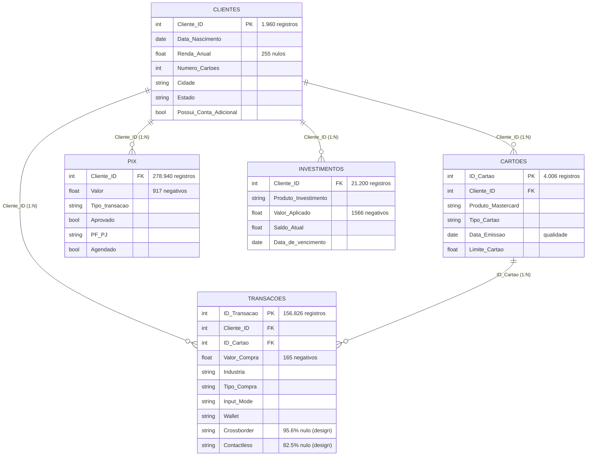
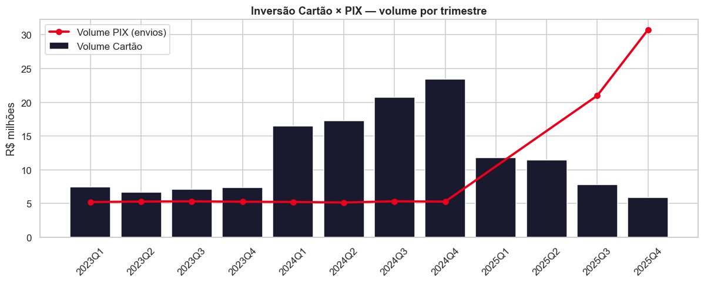
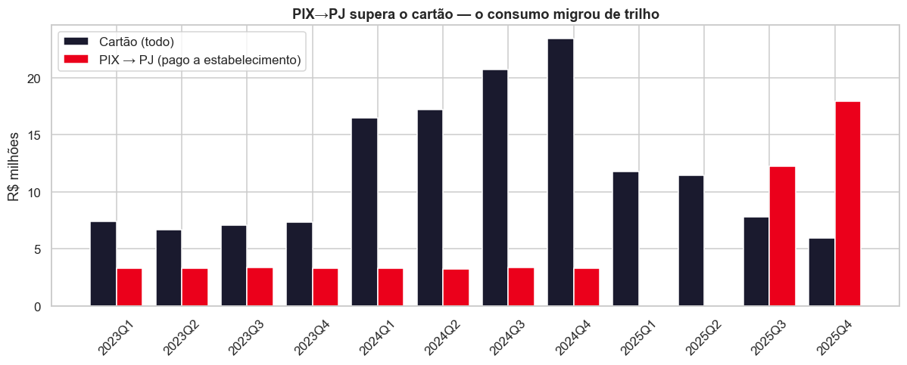
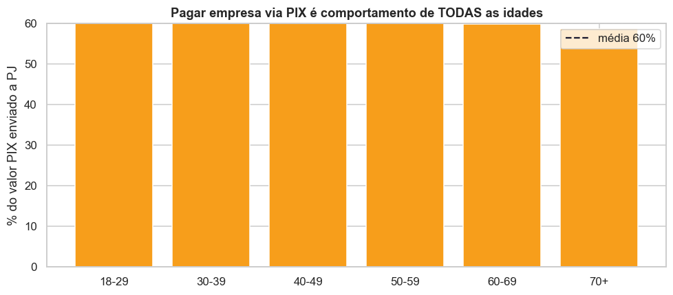

# Análise Exploratória de Dados
**Priceless Bank · Mastercard Challenge 2026**
---

## 1. O problema e o objetivo

O Priceless Bank vem perdendo participação de mercado de forma acelerada nos últimos trimestres de 2025. Em valor transacionado, caiu de **33% para 19% de market share** em apenas quatro trimestres. Quem mais avançou no período foi a **LuminaPay** (17% para 30%) e a **Aurora Bank** (8% para 14%).

O time de Advisors da Mastercard foi chamado para achar os pontos críticos por trás dessa queda e propor um caminho de solução. Este documento é a parte do diagnóstico.

### Evolução de market share em 2025 (valor transacionado)

| Player | 2025 Q1 | 2025 Q2 | 2025 Q3 | 2025 Q4 | Variação |
|--------|---------|---------|---------|---------|---|
| **Priceless Bank** | **33%** | **28%** | **23%** | **19%** | **-14 p.p.** |
| LuminaPay | 17% | 23% | 28% | 30% | +13 p.p. |
| Papaya Bank | 33% | 31% | 30% | 28% | -5 p.p. |
| Aurora Bank | 8% | 9% | 11% | 14% | +6 p.p. |
| Lux Bank | 6% | 7% | 8% | 9% | +3 p.p. |

> **Leitura:** o Priceless perdeu share em todos os trimestres. A LuminaPay ultrapassou o banco já no meio do ano e hoje tem mais que o dobro do que tinha em janeiro. A Aurora quase dobrou. Só o Papaya também recua, mas num ritmo bem menor.

---

## 2. Quem são os concorrentes

O time de Strategy & Transformation da Mastercard fez um benchmarking com instituições parecidas com o Priceless. Esses dados ajudam a montar as hipóteses sobre a perda de share.

### LuminaPay (principal ameaça, nativo digital)

| Atributo | Detalhe |
|----------|---------|
| Perfil | Fintech nativa digital, com poucos anos de operação |
| Público-alvo | Jovens adultos, early adopters |
| Diferenciais | Programa de cashback · Sem taxa de cartão · **Pix no crédito** |
| Principais gastos | 1º Restaurantes · 2º Mercados · 3º Transporte |
| Maturidade digital | Alta |
| Canal de abertura e atendimento | 100% digital |
| Banco principal para % de clientes | 37,4% |
| Aceita Open Finance | Sim |
| % que exportou via Open Finance | 62% |
| NPS | 76 |

**Ligação com o problema:** o "Pix no crédito" é provavelmente o principal motivo da canibalização do cartão. Com essa função, o cliente faz Pix para qualquer estabelecimento (até os sem maquininha) e parcela como se fosse cartão, juntando a praticidade do Pix com o poder de compra do crédito. O Priceless não tem nada parecido, e isso explica tanto a fuga de clientes quanto o crescimento do Pix para empresas na base.

### Papaya Bank (concorrente tradicional, estável)

| Atributo | Detalhe |
|----------|---------|
| Perfil | Banco tradicional, bem consolidado |
| Público-alvo | Adultos de meia-idade e idosos |
| Diferenciais | Programa de pontos · Financiamentos · Cartão adicional sem anuidade |
| Principais gastos | 1º Mercados · 2º Automotivo · 3º Saúde |
| Maturidade digital | Baixa |
| Canal de abertura e atendimento | Digital e físico (agência) |
| Banco principal para % de clientes | 42,7% |
| Aceita Open Finance | Sim |
| % que exportou via Open Finance | 44% |
| NPS | 64 |

**Ligação com o problema:** o Papaya atende quase o mesmo público do Priceless (adultos de meia-idade), o que mostra sobreposição. A queda leve dele (-5 p.p.) sugere que os dois bancos tradicionais estão perdendo para os nativos digitais. Ainda assim, o Papaya tem o maior índice de "banco principal" (42,7%), sinal de uma base mais fiel.

### Aurora Bank (crescimento acelerado, foco em investimentos)

| Atributo | Detalhe |
|----------|---------|
| Perfil | Nativo digital, com forte foco em investimentos |
| Público-alvo | Jovens adultos de alta renda |
| Diferenciais | Investimentos exclusivos · Home Broker · **Investimento que vira limite de crédito** |
| Principais gastos | 1º Restaurantes · 2º Lazer · 3º Automotivo |
| Maturidade digital | Média |
| Canal de abertura e atendimento | Físico (agência) e digital |
| Banco principal para % de clientes | 13,6% |
| Aceita Open Finance | Sim |
| % que exportou via Open Finance | 79% |
| NPS | 55 |

**Ligação com o problema:** a Aurora quase dobrou de tamanho em 2025. O diferencial dela, transformar saldo de investimento em limite de crédito, cria um laço de retenção forte, porque quem investe não vai embora para não perder o limite. Como o Priceless tem a **Reservinha** (liquidez diária), existe aqui uma oportunidade parecida que ainda não foi usada.

### Lux Bank (nicho premium, menos relevante para o diagnóstico)

| Atributo | Detalhe |
|----------|---------|
| Perfil | Banco affluent, carteira de clientes selecionada |
| Público-alvo | Adultos de meia-idade com alta renda |
| Diferenciais | Concierge · Sala VIP · Programa de fidelidade premium |
| Principais gastos | 1º Viagem · 2º Restaurantes · 3º Automotivo |
| Maturidade digital | Baixa |
| Canal de abertura e atendimento | Físico (agência) e digital |
| Banco principal para % de clientes | 6,4% |
| Aceita Open Finance | Não |
| % que exportou via Open Finance | 82% |
| NPS | 82 |

**Ligação com o problema:** o Lux cresce pouco (+3 p.p.) e atua num nicho premium à parte. O NPS de 82, o maior do mercado, vem de um portfólio de benefícios exclusivos que gera muito valor percebido. Não é a ameaça principal, mas mostra que benefícios de estilo de vida (viagem, concierge) são muito valorizados na alta renda, faixa onde o Priceless também tem clientes Black e Platinum.

### Mapa competitivo consolidado

| | Priceless | LuminaPay | Papaya | Aurora | Lux |
|--|--|--|--|--|--|
| Posição Q4/2025 | 19% | 30% | 28% | 14% | 9% |
| Perfil do cliente | Adulto, renda média-alta | Jovem digital | Adulto e idoso | Jovem, alta renda | Adulto, alta renda |
| Diferencial central | nenhum claro | Pix no crédito | Pontos e financiamento | Investimento vira limite | Lifestyle premium |
| Maturidade digital | a medir | Alta | Baixa | Média | Baixa |
| NPS | a medir | 76 | 64 | 55 | 82 |
| Banco principal | a medir | 37,4% | 42,7% | 13,6% | 6,4% |

> **O gap fica claro:** o Priceless não tem diferencial forte em nenhuma dessas dimensões. A falta do Pix no crédito é a lacuna mais urgente, e a falta de NPS e de dados de engajamento conhecidos limita o diagnóstico completo.

---

## 3. Visão geral das bases

| Base | Registros | Colunas | Nulos | % Nulos | Chave |
|------|-----------|---------|-------|---------|-------|
| Clientes | 1.960 | 8 | 255 | 1,6% | Cliente_ID (PK) |
| Cartões | 4.006 | 7 | 450 | 16,1% | ID_Cartao (PK) |
| Transações | 156.826 | 13 | 393.244 | 19,3% | ID_Transacao (PK) |
| Pix | 278.940 | 8 | 836 | 0,04% | sem PK |
| Investimentos | 21.200 | 7 | 28 | 0,02% | sem PK |

**Período coberto:** janeiro de 2023 a dezembro de 2025.

**Chave que liga tudo:** `Cliente_ID` aparece em todas as bases. `ID_Cartao` liga os cartões às transações.

---

## 4. Como as bases se conectam

Onde aparece "design", é comportamento esperado do sistema, não erro.

---

## 5. Cobertura dos clientes por base

| Cobertura | Qtd clientes | % do total |
|-----------|-------------|------------|
| Total na base de clientes | 1.960 | 100% |
| Com transações por cartão | 1.431 | 73% |
| Com atividade no Pix | 1.430 | 73% |
| Com investimentos | 1.003 | 51% |
| Transações e Pix ao mesmo tempo | 1.056 | 54% |
| Transações, Pix e investimentos | 534 | 27% |
| Sem transação de cartão (podem ter Pix/investimento) | 529 | 27% |
| Sem nenhuma atividade em base alguma | 85 | 4,3% |

**Achado importante:** 27% dos clientes (529) não têm transação de cartão, mas a maioria ainda usa Pix ou investe. Só **85 (4,3%)** não aparecem em base nenhuma — são as "contas fantasma" detalhadas na seção 14. Os dois grupos merecem investigação de ativação.

---

## 6. Base de clientes: o perfil de quem está aqui

### Dicionário de colunas

| Campo | Tipo | Descrição | Observações |
|-------|------|-----------|-------------|
| `Cliente_ID` | INT | Identificador único do cliente | Chave primária, presente em todas as bases |
| `Data_Nascimento` | DATE | Data de nascimento | Formato DD/MM/AAAA |
| `Renda_Anual` | FLOAT | Renda anual informada, em reais | 255 nulos (13%), é dado declarado |
| `Data_Criacao_Conta` | DATE | Data de criação da conta | Cobre jan/2023 a dez/2025 |
| `Numero_Cartoes` | INT | Quantos cartões o cliente tem | Varia de 1 a 4 |
| `Cidade` | STR | Cidade de residência | sem observação |
| `Estado` | STR | Estado de residência | 6 estados: SP, MG, RS, BA, PR, RJ |
| `Possui_Conta_Adicional` | STR | Se tem conta adicional (Sim/Não) | 21,2% têm |

### Dados principais

- **1.960 clientes únicos**, com conta criada entre jan/2023 e dez/2025.
- **Idade média de 49,5 anos** (mediana 50, mínimo 18, máximo 76).
- **Renda média de R$ 85.020** (mediana R$ 85.000, de R$ 20 mil a R$ 150 mil).
- **255 clientes (13%)** não informaram a renda.
- Distribuição geográfica uniforme entre os 6 estados (cerca de 320 clientes em cada).
- 21,2% têm conta adicional.

### Distribuição por faixa etária

| Faixa | Clientes |
|-------|----------|
| 18-29 | 115 |
| 30-39 | 279 |
| 40-49 | 578 |
| 50-59 | 562 |
| 60-69 | 336 |
| 70+ | 90 |

### Distribuição de cartões por cliente

- 1 cartão: 520 clientes (26,5%)
- 2 cartões: 439 clientes (22,4%)
- 3 cartões: 471 clientes (24%)
- 4 cartões: 530 clientes (27%)

*A base se concentra acima dos 40 anos, e a abertura de contas novas despencou (1.547 em 2023 para 189 em 2025).*

**O que isso diz para o diagnóstico:** o cliente típico é de meia-idade e renda média-alta. A LuminaPay, que mais ganhou share, foca em jovens e early adopters, justo o público que o Priceless não está cobrindo. A base tende a envelhecer sem renovação pelo público digital.

---

## 7. Base de cartões: portfólio e pontos de atenção

### Dicionário de colunas

| Campo | Tipo | Descrição | Observações |
|-------|------|-----------|-------------|
| `ID_Cartao` | INT | Identificador único do cartão | Chave primária, liga às transações |
| `Produto_Mastercard` | STR | Variante do cartão (Gold, Platinum, Black, Maestro/Debit, Standard) | Platinum 30,7%, Black 23,7% |
| `Tipo_Cartao` | STR | Crédito ou Débito | 85% crédito, 15% débito |
| `Data_Emissao` | DATETIME | Quando o cartão foi emitido | sem observação |
| `Data_Ativacao` | DATETIME | Quando o cartão foi ativado | atenção: 450 registros com ativação antes da emissão |
| `Data_Validade` | DATE | Data de validade | atenção: 450 nulos (os mesmos 450 do erro de ativação) |
| `Limite_Cartao` | FLOAT | Limite de crédito, em reais | Débito tem limite zero |

### Composição do portfólio

| Produto | Qtd | % |
|---------|-----|---|
| Platinum | 1.229 | 30,7% |
| Black | 949 | 23,7% |
| Gold | 804 | 20,1% |
| Maestro/Debit | 606 | 15,1% |
| Standard | 418 | 10,4% |

- 85% crédito, 15% débito.
- Limite médio de crédito: **R$ 16.146** (mediana R$ 16.000).
- Limites por produto: Standard de R$ 1k a 5k, Gold de R$ 5k a 15k, Platinum de R$ 15k a 30k, Black de R$ 30k a 52k.

### Pontos de atenção

**1. 450 cartões ativados antes da emissão (11,2%).** A data de ativação é anterior à de emissão, o que é impossível. Esses mesmos 450 cartões também têm a data de validade nula. A causa provável é um erro na geração dos dados de simulação. A recomendação é tirar esses 450 das análises de tempo.

**2. 469 cartões sem nenhuma transação (11,7%).** Foram emitidos, estão na base, mas nunca foram usados. A distribuição é Black (124), Gold (118), Platinum (114) e Standard (110). É um sinal forte de não engajamento depois da emissão, e um bom previsor de churn.

**3. 1.018 cartões vencidos (28,5% dos que têm validade).** A validade já passou em relação a junho de 2026. Não é erro, mas pode indicar cartões não renovados, ou seja, possível churn.

---

## 8. Base de transações: o comportamento de consumo

> Esta é a base mais importante para o diagnóstico. Ela registra o uso do cartão, que é o produto central do banco.

### Dicionário de colunas

| Campo | Tipo | Descrição | Observações |
|-------|------|-----------|-------------|
| `ID_Transacao` | INT | Identificador único da transação | Chave primária |
| `Data` | DATETIME | Quando a transação aconteceu | jan/2023 a dez/2025 |
| `Valor_Compra` | FLOAT | Valor da compra | atenção: 165 valores negativos (estornos), maior outlier R$ 107.777 |
| `Industria` | STR | Setor da compra (Alimentação, Varejo, Saúde, etc.) | 6 setores, Varejo é 35% |
| `Tipo_Compra` | STR | CP (presencial) ou CNP (online) | 70% CP, 30% CNP |
| `Qtd_Parcelas` | INT | Número de parcelas, se houver | 72% nulo, que significa à vista |
| `Wallet` | STR | Carteira digital usada (Apple, Google, Samsung Pay) | 85,9% nulo, correto, só quando houve wallet |
| `Cliente_ID` | INT | Cliente que fez a compra | liga à base de clientes |
| `ID_Cartao` | INT | Cartão usado | liga à base de cartões |
| `Input_Mode` | STR | Modo de entrada (Chip, Swiped, PayPass, eCommerce, etc.) | 8 modalidades |
| `Input_Mode_Code` | INT | Código do modo de entrada | versão codificada do anterior |
| `Crossborder` | INT | Se foi internacional (1 sim, 0 não) | 95,6% nulo, por design, só em compra online |
| `Contactless` | INT | Se foi por aproximação (1 sim, 0 não) | 82,5% nulo, por design, só em compra física |

### Dados principais

- **156.826 transações**, de 1.431 clientes, em 3.537 cartões.
- Período de jan/2023 a dez/2025.
- Ticket médio de R$ 913, mediana de R$ 690.

### Distribuição por indústria

| Indústria | Transações | % |
|-----------|-----------|---|
| Varejo | 54.849 | 35% |
| Alimentação | 39.259 | 25% |
| Tecnologia | 31.429 | 20% |
| Entretenimento | 12.765 | 8% |
| Saúde | 10.943 | 7% |
| Educação | 7.581 | 5% |

Educação e Tecnologia têm os maiores tickets médios (cerca de R$ 1.200), e Alimentação o mais baixo (cerca de R$ 600).

### Canais e tipo de compra

- Canais de entrada: PayPass 23,3%, Chip 23,3%, Swiped 23,3%, e o restante dividido entre Phone Order, eCommerce, MasterPass, Recurring e Mail Order.
- Tipo de compra: 70% presencial (CP), 30% online (CNP).
- Parcelamento: 72% à vista, 28% parcelado (média de 6,5 parcelas, até 12).

*70% do valor de cartão é presencial, exatamente a fatia disputada pelo Pix.*

### Pontos de atenção

- **Crossborder com 95,6% nulo** e **Contactless com 82,5% nulo** não são erros: cada um só é preenchido em um tipo de transação (online e física, respectivamente).
- **165 valores negativos (0,1%):** possíveis estornos. A recomendação é excluir ou marcar com uma flag.
- **Wallet com 85,9% nulo:** correto, só aparece quando o cliente usa Apple, Google ou Samsung Pay. As 22.110 transações com wallet se dividem de forma equilibrada entre as três.
- **Outliers:** 84 transações acima de R$ 10 mil e 7 acima de R$ 50 mil. O máximo foi R$ 107.777 em Educação. Podem ser legítimas, mas distorcem as médias.

---

## 9. Base de Pix: o comportamento de transferências

> É a maior base disponível, com 278.940 registros, e revela o padrão mais crítico da migração de meios de pagamento.

### Dicionário de colunas

| Campo | Tipo | Descrição | Observações |
|-------|------|-----------|-------------|
| `Cliente_ID` | INT | Cliente que fez o Pix | liga à base de clientes |
| `Valor` | FLOAT | Valor do Pix | atenção: 917 negativos e 591 zeros, incoerentes |
| `Data` | DATETIME | Quando o Pix aconteceu | atenção: 418 nulos |
| `Pix_para_si_mesmo` | INT | Se é entre contas do mesmo dono (1 sim, 0 não) | 11,6% são para si mesmo |
| `Tipo_transacao` | STR | "Envio" ou "Recebimento" | 88% envios, 12% recebimentos |
| `Aprovado` | INT | Se foi aprovado (1 sim, 0 não) | atenção: 10% dos envios não aprovados |
| `PF_PJ` | STR | Se o destino é pessoa física ou empresa | 62% empresa, ou seja, pagamento em estabelecimento |
| `Agendado` | STR | Se foi agendado (Sim/Não) | só 2% agendados |

### Dados principais

- **278.940 registros**, de 1.430 clientes.
- Média de 195 Pix por cliente.
- Valor mediano do Pix (envios positivos): R$ 195.

### Distribuição dos Pix

| Dimensão | Valor | % |
|----------|-------|---|
| Envios | 245.665 | 88% |
| Recebimentos | 32.857 | 12% |
| Aprovados | 250.855 | 89,9% |
| Não aprovados | 28.085 | 10,1% |
| Para empresa (PJ) | 172.564 | 61,9% |
| Para pessoa (PF) | 106.376 | 38,1% |
| Para si mesmo | 32.305 | 11,6% |
| Agendados | 5.531 | 2% |

### Pontos de atenção

- **917 valores negativos (0,3%)** e **591 valores zero (0,2%):** não fazem sentido operacional. Podem ser estorno, erro de sinal ou fraude. Vale investigar com a equipe de risco.
- **418 registros com data e tipo nulos:** incompletos, devem sair da análise temporal.
- **28.085 registros não aprovados (10%):** a taxa de aprovação é **constante em 90,0%** em todo trimestre, para PF e PJ e em todo quartil de valor (ver *Radar 2 — sinal × constante* no notebook). É uma característica do gerador de dados sintéticos — não sustenta leitura de fraude nem de fricção. Para volume efetivo, filtramos `Aprovado = 1`.

**O ponto central:** ~62% das transações (e ~60% do valor) dos envios vão para empresas. Ou seja, os clientes estão usando Pix para pagar em estabelecimentos, no lugar do cartão. Esse é um dos fatores mais prováveis da queda de share.

---

## 10. Base de investimentos: a carteira do banco

### Dicionário de colunas

| Campo | Tipo | Descrição | Observações |
|-------|------|-----------|-------------|
| `Cliente_ID` | INT | Cliente da operação | liga à base de clientes |
| `Data_Abertura_Conta_Inv` | INT | Abertura da conta de investimento | formato AAAAMM, precisa converter |
| `Data` | INT | Data da operação | formato AAAAMM, diferente das outras bases |
| `Valor_Aplicado` | FLOAT | Valor da operação | 1.566 negativos são resgates, comportamento normal |
| `Saldo_Atual` | FLOAT | Saldo do produto na data | 2.551 com saldo zero (produto vencido ou resgatado) |
| `Produto_Investimento` | STR | Nome do produto | Reservinha, Renda Variável, Tesouro Direto, Renda Fixa |
| `Data_de_vencimento` | INT | Vencimento do produto | 299901 em toda a Reservinha, que não tem vencimento (esperado) |

### Dados principais

- **21.200 registros**, de 1.003 clientes (51% da base).
- Média de 21 operações por cliente ao longo do tempo.
- Saldo médio atual de R$ 20.740.

### Distribuição por produto

| Produto | Registros | % | Característica |
|---------|-----------|---|----------------|
| Reservinha | 7.864 | 37,1% | Liquidez diária, sem vencimento |
| Renda Variável | 4.534 | 21,4% | Risco maior, retorno maior |
| Tesouro Direto | 4.471 | 21,1% | Renda fixa pública |
| Renda Fixa | 4.331 | 20,4% | Renda fixa privada |

### Comportamentos esperados (não são erros)

- **Valor aplicado negativo (1.566 registros):** são resgates, normal numa carteira. Basta separar aportes (positivos) de resgates (negativos).
- **Vencimento 299901 (7.864 registros):** todos são Reservinha, produto de liquidez diária sem vencimento.
- **Saldo zero (2.551 registros):** produto vencido ou totalmente resgatado.
- **Datas em formato AAAAMM:** diferente das outras bases, precisa converter para análises de tempo.

**O que isso diz para o diagnóstico:** a Reservinha (37% dos registros) funciona como um cofre de liquidez diária, quase uma poupança. Quem investe tende a ser mais engajado e fiel, então esse produto pode virar um diferencial de retenção frente à LuminaPay.

---

## 11. A virada do cartão para o Pix

Aqui está o sinal mais crítico de todo o diagnóstico.

### Volume de cartão por trimestre

| Trimestre | Volume cartão | Qtd transações |
|-----------|--------------|-----------|
| 2023Q1 | R$ 7,4M | 12.233 |
| 2023Q2 | R$ 6,6M | 10.792 |
| 2023Q3 | R$ 7,1M | 11.579 |
| 2023Q4 | R$ 7,4M | 11.921 |
| **2024Q1** | **R$ 16,5M** | **10.642** |
| **2024Q2** | **R$ 17,2M** | **10.921** |
| **2024Q3** | **R$ 20,7M** | **13.180** |
| **2024Q4** | **R$ 23,5M** | **15.118** |
| 2025Q1 | R$ 11,8M | 19.117 |
| 2025Q2 | R$ 11,5M | 18.713 |
| 2025Q3 | R$ 7,8M | 12.793 |
| 2025Q4 | R$ 5,9M | 9.652 |

*Universo: transações com valor positivo (sem estornos), como em todo o notebook.*

### Volume de Pix enviado por trimestre

| Trimestre | Volume Pix | Qtd Pix |
|-----------|-----------|---------|
| 2023Q1 | R$ 5,2M | 20.930 |
| 2023Q2 | R$ 5,3M | 21.111 |
| 2023Q3 | R$ 5,3M | 21.317 |
| 2023Q4 | R$ 5,2M | 21.057 |
| 2024Q1 | R$ 5,2M | 20.997 |
| 2024Q2 | R$ 5,1M | 20.911 |
| 2024Q3 | R$ 5,3M | 21.391 |
| 2024Q4 | R$ 5,3M | 21.122 |
| **2025Q3** | **R$ 21,0M** | **20.555** |
| **2025Q4** | **R$ 30,7M** | **30.408** |

*Universo canônico: envios aprovados (`Valor > 0`, data válida, `Aprovado = 1`).*

### O achado: a inversão em 2025

Em 2025 acontece uma virada forte:

- O cartão cai **50% ao longo de 2025** (R$ 11,8M em Q1 → R$ 5,9M em Q4). Contra o pico de 2024Q4 (R$ 23,5M) a queda em valor é de 75% — mas o ticket de 2024 é um artefato dos dados (2,5×); em **quantidade**, 2024Q4→2025Q4 é −36%.
- O Pix aprovado, estável em cerca de R$ 5,3M por trimestre até 2024, explode para **R$ 30,7M (2025Q4)**, um salto de +485%.

A razão entre Pix e cartão (em quantidade) cresce trimestre a trimestre, o que mostra uma substituição sistemática do cartão pelo Pix.

*O cartão (barras) é ultrapassado pelo Pix (linha) ao longo de 2025.*

> **Nota de método:** parte da queda no número de transações de 2025 pode vir de os dados serem mais recentes e ainda incompletos. Mas a dimensão da virada é grande demais para ser só um artefato dos dados.

---

## 12. Quanto de intercâmbio o banco perdeu

> O **intercâmbio** é a tarifa que o banco recebe a cada compra aprovada no cartão. O Pix tem intercâmbio zero por regra do Banco Central. Então toda compra que vira Pix zera essa receita.

### Como calculamos

| Parâmetro | Valor | Fonte |
|-----------|-------|-------|
| Intercâmbio no crédito | 1,8% | Benchmark Mastercard Brasil (média doméstica) |
| Intercâmbio no débito | 0,6% | Teto da regra do BACEN |
| Taxa média do portfólio | 1,60% | 83,6% crédito a 1,8% + 16,4% débito a 0,6%, ponderado por volume |
| Ticket-base normalizado | R$ 615 | Mediana de 2023 e 2025 (tira a anomalia de 2024) |
| Trimestre de referência | 2023Q4 normalizado | Último antes da anomalia de ticket de 2024 |

> **Atenção ao ticket de 2024:** o ticket médio de 2024 é cerca de R$ 1.550, exatamente 2,5 vezes o de 2023 e 2025 (cerca de R$ 615). Isso é um artefato dos dados sintéticos do desafio (mesma quantidade de transações, mas volume 2,5 vezes maior). Para comparar trimestres, usamos o intercâmbio normalizado (quantidade real vezes ticket-base vezes taxa média), que tira essa distorção.

> **Dado ausente:** os registros de Pix de 2025Q1 e Q2 não estão no dataset. A conta de custo de oportunidade do Pix cobre só os trimestres disponíveis.

### Intercâmbio estimado por trimestre

| Trimestre | Vol. cartão | Qtd | Ticket | Intercâmbio real | Intercâmbio normalizado | Perda vs 2023Q4 |
|-----------|-------------|---------|-------------|-----------------|------------------|----------------|
| 2023Q1 | R$ 7,4M | 12.233 | R$ 607 | R$ 119k | R$ 120k | referência |
| 2023Q2 | R$ 6,6M | 10.792 | R$ 615 | R$ 107k | R$ 106k | R$ 11k |
| 2023Q3 | R$ 7,1M | 11.579 | R$ 612 | R$ 114k | R$ 114k | R$ 3k |
| 2023Q4 | R$ 7,4M | 11.921 | R$ 618 | R$ 118k | **R$ 117k (ref.)** | referência |
| 2024Q1 | R$ 16,5M | 10.642 | **R$ 1.550** | R$ 264k | R$ 105k | R$ 13k |
| 2024Q2 | R$ 17,2M | 10.921 | **R$ 1.579** | R$ 278k | R$ 107k | R$ 10k |
| 2024Q3 | R$ 20,7M | 13.180 | **R$ 1.573** | R$ 333k | R$ 130k | sem perda |
| 2024Q4 | R$ 23,5M | 15.118 | **R$ 1.552** | R$ 377k | R$ 149k | sem perda |
| 2025Q1 | R$ 11,8M | 19.117 | R$ 617 | R$ 188k | R$ 188k | sem perda |
| 2025Q2 | R$ 11,5M | 18.713 | R$ 613 | R$ 183k | R$ 184k | sem perda |
| 2025Q3 | R$ 7,8M | 12.793 | R$ 610 | R$ 124k | R$ 126k | **R$ 0** |
| 2025Q4 | R$ 5,9M | 9.652 | R$ 613 | R$ 94k | R$ 95k | **R$ 22k por tri** |

> **Sobre 2025Q1 e Q2:** o ticket é normal (R$ 615), mas a quantidade de transações em Q1 (19.117) e Q2 (18.713) é anormalmente alta perto do histórico (11 a 13 mil por trimestre), o que infla o intercâmbio. Em Q3 e Q4 o volume cai de volta e o intercâmbio cai para a faixa de R$ 94 a 124 mil.

### Custo de oportunidade do Pix para empresas

| Trimestre | Vol. Pix para PJ | Qtd Pix | Oportunidade de intercâmbio (1,8%) |
|-----------|-------------|---------|--------------------------|
| 2023 (média) | cerca de R$ 3,3M por tri | cerca de 13.300 por tri | cerca de R$ 60k por tri |
| 2024 (média) | cerca de R$ 3,3M por tri | cerca de 13.300 por tri | cerca de R$ 59k por tri |
| 2025Q3 | **R$ 12,2M** | 11.972 | **R$ 220k** |
| 2025Q4 | **R$ 17,9M** | 17.674 | **R$ 322k** |

*Universo: Pix→PJ aprovado — o mesmo usado no dimensionamento da perda e da solução.*

### O impacto em poucos números

| Métrica | Valor |
|---------|-------|
| Intercâmbio em 2025Q4 (normalizado) | R$ 95k por trimestre |
| Custo de oportunidade do Pix para PJ em 2025Q4 | **R$ 322k por trimestre** |
| Razão Pix PJ (aprovado) sobre volume de cartão em 2025Q4 | **3,0 vezes** (o Pix PJ supera o cartão) |
| Se o banco recuperasse 50% do Pix PJ para cartão | mais R$ 161k por tri, cerca de 170% da receita atual |
| Oportunidade anual não capturada no Pix PJ (25Q4 anualizado) | cerca de R$ 1,29 milhão por ano |

*O Pix para empresas ultrapassa o volume total de cartão em 2025, a canibalização direta do meio de pagamento.*

**A leitura:** em 2025Q4, o volume de Pix aprovado para estabelecimentos (R$ 17,9M) é 3,0 vezes o volume total de cartão (R$ 5,9M). Se só 30% desse Pix PJ virasse compra no crédito, o banco quase dobraria a receita de intercâmbio do trimestre. E a perda não é só de dinheiro: cada Pix para empresa também é uma perda de dado de consumo (setor, ticket, recorrência) que alimenta score, ofertas e cross-sell.

---

## 13. Idade e uso do Pix

Cruzando a base de clientes com a de Pix dá para entender quem usa Pix, com que intensidade e quanto movimenta por faixa de idade.

### Penetração do Pix por faixa etária

| Faixa | Clientes | Usa Pix | % penetração | Sem Pix |
|-------|----------|---------|-------------|---------|
| 18-29 | 115 | 77 | 67% | 38 |
| 30-39 | 279 | 203 | 73% | 76 |
| 40-49 | 578 | 442 | **76%** | 136 |
| 50-59 | 562 | 409 | 73% | 153 |
| 60-69 | 336 | 233 | 69% | 103 |
| 70+ | 90 | 66 | 73% | 24 |

> A maior penetração está na faixa 40-49 (76%), não na mais jovem. A faixa 18-29 tem a menor (67%), mas isso engana: ela é a menor faixa do banco, sinal de que o Priceless não está captando o público jovem.

### Intensidade de uso e volume por cliente

| Faixa | Pix por cliente | Cartão por cliente | Razão Pix sobre cartão | Vol. Pix/cliente | Vol. cartão/cliente | Mediana Pix |
|-------|-----------|--------------|----------------------|------------|----------------|-------------|
| **18-29** | **393** | **119** | **3,3 vezes** | **R$ 138k** | R$ 107k | R$ 188 |
| 30-39 | 163 | 107 | 1,5 vezes | R$ 69k | R$ 98k | R$ 191 |
| 40-49 | 163 | 107 | 1,5 vezes | R$ 70k | R$ 97k | R$ 192 |
| 50-59 | 163 | 112 | 1,5 vezes | R$ 72k | R$ 104k | R$ 203 |
| 60-69 | 154 | 114 | 1,4 vezes | R$ 66k | R$ 103k | R$ 197 |
| **70+** | **175** | **97** | **1,8 vezes** | **R$ 86k** | R$ 88k | **R$ 251** |

**Os achados:**

- **Faixa 18-29, o alerta mais urgente.** Fazem 3,3 vezes mais Pix do que cartão por pessoa, a maior razão de todas. O volume de Pix por cliente (R$ 138k) é o dobro das faixas do meio. Eles têm cartão e têm limite, mas escolhem o Pix de propósito. São só 115 clientes: o banco não está captando o jovem que, quando existe, já prefere o Pix.
- **Faixa 70+, a surpresa.** Segunda maior razão Pix sobre cartão (1,8 vezes). Fazem menos Pix, mas de valores maiores (mediana de R$ 251, contra R$ 188 a 203 nas outras).
- **Faixas 40-59, o núcleo atual.** Menor razão Pix sobre cartão (1,4 a 1,5 vezes), ainda usam cartão de forma equilibrada. Mas por serem os maiores grupos, respondem pelo maior volume absoluto de Pix.

### Volume de Pix e a parte que vai para empresas

| Faixa | Vol. total Pix | Vol. Pix para PJ | % PJ | Qtd Pix para PJ |
|-------|--------------|------------|------|-----------|
| 18-29 | R$ 8,5M | R$ 5,3M | 62% | 14.996 |
| 30-39 | R$ 12,4M | R$ 7,5M | 60% | 18.161 |
| 40-49 | R$ 27,8M | R$ 16,7M | 60% | 39.718 |
| 50-59 | R$ 26,1M | R$ 15,8M | 61% | 36.833 |
| 60-69 | R$ 13,8M | R$ 8,3M | 60% | 19.884 |
| 70+ | R$ 5,0M | R$ 3,0M | 59% | 6.357 |

*Universo: envios aprovados (volume total e Pix→PJ no mesmo recorte).*

> A proporção de Pix para empresas é parecida em todas as faixas (59% a 62% do valor enviado). Ou seja, a canibalização do cartão é um comportamento de toda a base, não de um grupo só.

*Pagar empresa por Pix é comportamento de toda a base, em todas as idades.*

### Como cresceu em 2025 por faixa

Volume de Pix enviado, de Q3 para Q4 de 2025:

| Faixa | 2025Q3 | 2025Q4 | Crescimento |
|-------|--------|--------|-------------|
| 18-29 | R$ 1,12M | R$ 1,63M | +46% |
| 30-39 | R$ 2,82M | R$ 4,35M | +54% |
| 40-49 | R$ 6,55M | R$ 9,54M | +46% |
| 50-59 | R$ 6,00M | R$ 8,90M | +48% |
| 60-69 | R$ 3,33M | R$ 4,78M | +43% |
| 70+ | R$ 1,16M | R$ 1,55M | +34% |

> O crescimento em Q4 é forte e parecido em todas as faixas (de +34% a +54%). Nenhuma está revertendo a tendência, a migração está acelerando na base inteira ao mesmo tempo.

**Três dimensões do problema:**

1. **Captação:** o banco tem pouquíssimos jovens (18-29 é só 5,9% da base). O público que mais adota Pix e que a LuminaPay conquista está mal representado aqui.
2. **Comportamento:** dentro de cada faixa, o Pix já supera o cartão em frequência. Não é problema só dos jovens, é estrutural da base toda.
3. **Aceleração:** o crescimento de Q3 para Q4 é forte em todas as faixas. A janela para agir está se fechando antes que a preferência pelo Pix vire hábito definitivo.

---

## 14. Sinais de abandono (churn)

O churn num banco emissor aparece de cinco formas. Os dados deixam medir quatro delas de forma direta.

### Os cinco cenários

| Tipo | Nome | Evidência | Urgência |
|------|------|-----------|---------|
| A | Churn silencioso (Pix) | Volume cartão -75%, Pix PJ +446% em 2025 | Crítica |
| B | Conta fantasma | 85 clientes sem registro em nenhuma base | Alta |
| C | Inatividade em 2025 | 87 sem atividade no ano — 85 são as próprias contas fantasma; **2** esfriaram em 2025 | Alta |
| D | Desinvestimento | Resgates acelerando, recorde em 2025Q4 | A acompanhar |
| E | Cartão vencido | 1.018 cartões expirados, 56% premium | Estrutural |

> **Limite de método:** os dados de Pix de 2025 cobrem só Q3 e Q4. Por isso o score de risco usa critérios de cartão e investimento, para não gerar falso positivo por causa dessa lacuna.

### [A] Churn silencioso: o Pix substitui o cartão

Já mostrado nas seções 11 e 12. Em resumo:

- Volume de cartão caiu 50% ao longo de 2025 (R$ 11,8M → R$ 5,9M); contra 2024Q4 a queda em valor é 75% (ticket-artefato; −36% em quantidade).
- Pix para empresas (aprovado) no mesmo período: de R$ 3,3M para R$ 17,9M, um salto de 446%.
- Em 2025Q4, o Pix PJ (R$ 19,9M bruto) supera o cartão em 3,4 vezes.
- A motivação: a LuminaPay tem "Pix no crédito", o cliente faz Pix e parcela como cartão. O Priceless não tem equivalente.

### [B] Contas fantasma

| Métrica | Valor |
|---------|-------|
| Clientes sem nenhuma atividade histórica | **85 (4,3%)** |
| Distribuição etária | 40-49: 20 · 50-59: 25 · 60-69: 18 · demais: 22 |
| Tempo médio de conta | 27 meses |
| Renda média | R$ 86.917 |
| Abertura | jan/2023 a dez/2025 |

**Provável motivo:** falha no onboarding. O cliente abriu a conta, talvez atraído por uma campanha, mas o produto não entregou valor para gerar a primeira transação. Em 26 meses, nunca fez um Pix, nunca usou o cartão, nunca investiu. É um padrão típico de banco sem uma jornada digital fluida na ativação.

### [C] Inatividade em 2025

| Métrica | Valor |
|---------|-------|
| Clientes sem atividade em 2025 (sem transação, Pix ou investimento) | **87 (4,4%)** |
| — dos quais contas fantasma (nunca tiveram atividade; cenário B) | 85 |
| — dos quais esfriaram em 2025 (tinham histórico e pararam) | **2** |

> **Nota de honestidade metodológica:** B e C se sobrepõem quase por completo — o churn "confirmado" novo de 2025 é de apenas 2 clientes. O sinal relevante de deterioração recente está nos **39** que sumiram entre Q3 e Q4 (abaixo) e no desinvestimento (cenário D).

Dentro desses 87:

| Sub-cenário | Clientes | Provável motivo |
|-------------|---------|-------------------|
| Esfriaram em 2025 (tinham histórico) | 2 | Migração ou abandono gradual |
| Sumiram entre Q3 e Q4 de 2025 (ativos no cartão em Q3, não em Q4) | **39** | Deterioração recente, ainda dá tempo de agir |

Nas contas fantasma, a concentração está nas faixas 50-59 (25) e 40-49 (20), justo o público que o Papaya conquista. Sobre os 39 que sumiram entre Q3 e Q4: a queda não foi de ticket (mediana estável em R$ 597 a 598), foi de frequência (menos 25% de transações). Ou seja, estão comprando menos vezes pelo cartão, não comprando menos.

### [D] Desinvestimento acelerado

| Trimestre | Operações de resgate | Volume resgatado |
|-----------|---------------------|-----------------|
| 2023 (média) | 23 a 36 por tri | cerca de R$ 25k por tri |
| 2024Q1 | 138 | R$ 677k |
| 2024Q2 | 154 | R$ 614k |
| 2024Q3 | 208 | R$ 1.302k |
| 2024Q4 | 210 | R$ 1.210k |
| 2025Q1 | 98 | R$ 862k |
| 2025Q2 | 105 | R$ 681k |
| 2025Q3 | 243 | R$ 1.593k |
| **2025Q4** | **284** | **R$ 1.632k (recorde)** |

161 clientes tiveram saldo líquido negativo em investimento em 2025 (resgataram mais do que aplicaram).

**Provável motivo:** rendimento dos produtos abaixo da concorrência. A Aurora, que quase dobrou de tamanho, tem investimentos exclusivos e Home Broker como diferencial. Quem investe compara rendimento e move o dinheiro para onde rende mais. A Reservinha, produto mais popular do Priceless, pode estar perdendo para opções com retorno melhor.

**Teste complementar (notebook):** hoje, investir **não** retém — a retenção no cartão (ativo em 2024 → ativo em 2025Q4) é 95,2% entre investidores e 95,6% entre não investidores, com gasto idêntico. O lock-in de investimento não existe na base atual; é exatamente o laço que a proposta (Reservinha-âncora + Saldo Vivo) é desenhada para criar.

### [E] Cartões vencidos sem renovação

| Produto | Cartões vencidos |
|---------|----------------|
| Platinum | 340 (33%) |
| Black | 241 (24%) |
| Gold | 195 (19%) |
| Maestro/Debit | 159 (16%) |
| Standard | 83 (8%) |
| **Total** | **1.018 (28,5% do portfólio válido)** |

Desses 1.018, só 4 nunca tiveram transação. A grande maioria estava em uso até meados de 2025. O vencimento é um momento de decisão: o cliente precisa pedir a renovação, e se o banco não facilita nem dá incentivo, a chance de churn sobe muito. Com 56% de cartões premium na lista (Platinum e Black, com limites de R$ 15k a 52k), o risco financeiro é alto.

### Score de risco consolidado

| Nível | Clientes | Características |
|-------|---------|----------------|
| Baixo | 1.398 | Ativos no cartão em Q3 e Q4 de 2025, sem sinais |
| Médio | 475 | Algum sinal (sem cartão em um dos trimestres recentes, ou desinvestindo) |
| Alto | 87 | Score ≥ 4: acumulam inatividade histórica/recente e desinvestimento |

*Score heurístico (pesos 3/2/1/1/1, corte em 4), calculado na seção 10 do notebook.*

**Sobre o tempo de conta:** o risco alto não se concentra nos clientes mais novos. Clientes com 2 a 3 anos de conta aparecem em todas as faixas de risco. Isso indica que o problema não é reter recém-chegados, e sim uma proposta de valor fraca para a base inteira.

### Resumo das motivações

| Motivação | Cenário | Evidência nos dados |
|-----------|---------|-------------------|
| O Pix é mais fácil (substituto funcional) | A | Pix PJ 3,4 vezes o cartão em Q4 2025 |
| Onboarding falho | B | 85 clientes, 26 meses de conta, zero atividade |
| Foi para o concorrente | C | 87 inativos em 2025, perfil do público Papaya e LuminaPay |
| Investimento rende menos | D | Resgates recordes em Q4 2025, Aurora crescendo |
| Falta de gestão do vencimento | E | 1.018 cartões vencidos sem renovação registrada |

---

## 15. Qualidade dos dados

### Crítico (impacto direto na análise)

| Problema | Base | Detalhe | Ação |
|----------|------|---------|------|
| Bug no código original | Notebook | `base_investimentos` carregava `Base_clientes.csv`, dados errados | **Corrigido** |

### Alto impacto

| Problema | Base | Qtd | Ação |
|----------|------|-----|------|
| Cartões inativos (sem transação) | Cartões | 469 (11,7%) | Investigar engajamento |
| Pix com valor negativo | Pix | 917 (0,3%) | Excluir ou investigar |
| Pix com valor zero | Pix | 591 (0,2%) | Excluir |
| Recebimentos de Pix negados | Pix | 3.392 (10,3%) | Investigar regra de negócio |

### Médio impacto

| Problema | Base | Qtd | Ação |
|----------|------|-----|------|
| Ativados antes da emissão | Cartões | 450 (11,2%) | Excluir da análise temporal |
| Validade nula (os mesmos 450) | Cartões | 450 | Excluir |
| Renda anual nula | Clientes | 255 (13%) | Imputar mediana ou marcar com flag |
| Valores negativos em transações | Transações | 165 (0,1%) | Excluir ou marcar estorno |
| Outliers extremos (acima de R$ 10k) | Transações | 84 (0,05%) | Tratar à parte |
| Data e tipo nulos no Pix | Pix | 418 (0,15%) | Excluir |

### Baixo impacto (comportamento esperado)

| Aparente problema | Base | Explicação |
|-------------------|------|------------|
| Crossborder 95,6% nulo | Transações | Por design, só preenchido em compra online |
| Contactless 82,5% nulo | Transações | Por design, só preenchido em compra física |
| Wallet 85,9% nulo | Transações | Correto, só quando há wallet |
| Parcelas 72% nulo | Transações | Correto, nulo é pagamento à vista |
| Valor aplicado negativo | Investimentos | São resgates, normal |
| Vencimento 299901 | Investimentos | Reservinha sem vencimento, esperado |
| Saldo zero | Investimentos | Produto vencido ou resgatado |

---

## 16. Ranking das bases por importância

**1º. Base de transações (10/10).** Registra direto o uso do cartão, o produto central do banco. Permite calcular volume por período, ticket, uso por cliente, comportamento por setor e canal. A evidência mais forte está aqui: o volume trimestral caiu cerca de 75% de 2024Q4 para 2025Q4. É a única base com informação de parcelamento.

**2º. Base de Pix (9/10).** A maior em volume (278.940 registros). Com ~60% do valor dos envios indo para empresas, é o concorrente direto do cartão. O crescimento explosivo em 2025 é o espelho da queda do cartão, e dá para medir a canibalização dentro da própria base. A taxa de aprovação constante de 90% em todo corte é uma característica do gerador de dados (ver Radar 2 do notebook), não um sinal de fricção.

**3º. Base de clientes (8/10).** A tabela mestre de segmentação. Sem ela não dá para perfilar nenhum achado. Permite cruzar tudo por idade, renda, região e número de cartões. A idade média de 49 anos e a renda de R$ 85k mostram um perfil que não bate com o público da LuminaPay.

**4º. Base de cartões (6/10).** Mostra portfólio e limites, útil para calcular a utilização do crédito. Os 469 cartões inativos (11,7%) já são um sinal claro de problema de engajamento. Não tem volume de tempo próprio, depende das transações.

**5º. Base de investimentos (5/10).** Presente em só 51% dos clientes. Não mostra direto o problema de share, mas pode ser estratégica como âncora de retenção, e a Reservinha é um diferencial ainda não explorado.

---

## 17. Principais conclusões

**1. O Pix está canibalizando o cartão.** O volume de cartão caiu 50% ao longo de 2025 (e 75% em valor contra o pico de 2024Q4 — inflado pelo ticket-artefato; −36% em quantidade), enquanto o Pix aprovado cresceu +485% no mesmo período. Com ~60% do valor dos envios indo para empresas, os clientes estão pagando em estabelecimentos por Pix no lugar do cartão — em 2025Q4 o Pix→PJ aprovado é 3,0× todo o volume de cartão. Este é o principal motivo da perda de share. A hipótese é o "Pix no crédito" da LuminaPay, que o Priceless não tem.

**2. Cartões não ativados e não renovados.** 469 cartões (11,7%) nunca fizeram uma única compra e 1.018 (28,5%) já venceram. A não ativação é um forte previsor de churn, e aponta falha de onboarding ou de estímulo depois da emissão.

**3. O perfil da base não acompanha o mercado que cresce.** Idade média de 49 anos e renda média de R$ 85k. A LuminaPay foca em jovens e early adopters. O banco está concentrado num público que, mesmo com renda, não está protegendo o share, que segue caindo.

**4. A aprovação de Pix é uma constante, não um sinal.** A taxa de aprovação é 90,0% em todo trimestre, para PF e PJ e em todo quartil de valor — característica do gerador de dados sintéticos (Radar 2). Não há evidência de fraude nem de fricção; o filtro `Aprovado = 1` é usado apenas para medir volume efetivo.

**5. O lock-in de investimento ainda não existe — e é a oportunidade.** A Reservinha é o produto mais popular (37% dos registros), mas o teste na base mostra que hoje investir não retém (95,2% vs 95,6% de retenção no cartão) nem aumenta gasto. O laço saldo → limite → uso proposto pela solução é justamente o mecanismo que falta — um diferencial frente à LuminaPay, que não tem investimento.

---

## 18. Próximos passos analíticos

1. **Segmento em risco:** idade e renda dos clientes com maior queda de uso de cartão em 2025.
2. **Cartões inativos:** quais segmentos e produtos concentram mais cartões sem uso?
3. **Benchmark interno:** o ticket médio do Priceless está acima ou abaixo do setor? Qual indústria está perdendo mais transações?

*Já executados no notebook: o cruzamento cliente a cliente cartão × Pix (a correlação individual é ~0 — a migração é uniforme na base, não rastreável por cliente) e o teste de fidelidade via investimento (sem diferença de retenção ou gasto).*

---

*Diagnóstico baseado na base Priceless Bank (1.960 clientes, 156.826 transações, 278.940 Pix, 21.200 investimentos), análise em `notebooks/main.ipynb`. Data de referência dos dados: 31/12/2025. Solução em [`proposta-solucao.md`](proposta-solucao.md) e plano em [`plano-de-acao.md`](plano-de-acao.md).*
