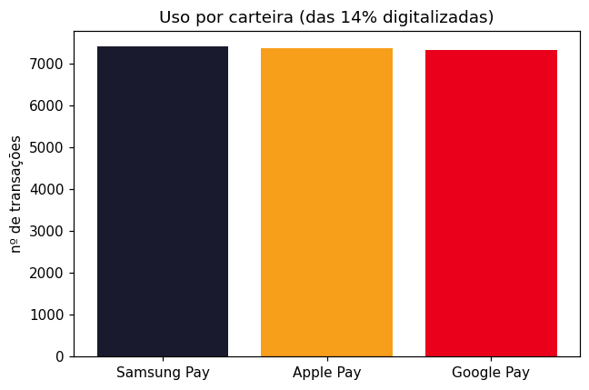

# Parte 2 — O Cartão na Era Digital
### Por que não competimos com o PIX no presencial, e onde o cartão é imbatível
**Mastercard Challenge 2026 | Priceless Bank | Data: 14/06/2026**

> Segunda das três frentes do plano de ação (1. recuperar receita · **2. inverter o cenário e mostrar o valor do uso digitalizado do cartão** · 3. atacar o LuminaPay e renovar a base).
> Análise conduzida **exclusivamente com dados internos** em [`notebooks/parte2_cartao_digital.ipynb`](../notebooks/parte2_cartao_digital.ipynb).
> Diagnóstico-mãe: [`analise-exploratoria.md`](analise-exploratoria.md) · Solução: [`propostas-solucao.md`](propostas-solucao.md).

---

## Tese em uma frase

Parar de brigar pelo pagamento que o PIX já venceu (presencial, miúdo, doméstico) e crescer o cartão onde o PIX, por desenho, não entra — online, recorrência, internacional e carteira digital.

---

## Parte A — Por que NÃO competimos com o PIX no presencial

A tentação óbvia é "trazer o pagamento de volta para o cartão", inclusive o de balcão via Apple Pay/contactless. Os dados mostram por que isso é correr atrás do prejuízo.

### A.1 — A inversão cartão → PIX em 2025

| Trimestre | Volume Cartão | Volume PIX (envios) |
|-----------|--------------|---------------------|
| 2023 (média/tri) | ~R$ 7,1M | ~R$ 5,5M |
| 2024Q4 (pico) | **R$ 23,5M** | ~R$ 5,5M |
| 2025Q4 | **R$ 5,9M** | **R$ 34,1M** |

O cartão cai **-75%** do pico (2024Q4) ao fim de 2025, enquanto o PIX multiplica. *(O degrau de 2024 vem do ticket inflado — a leitura honesta foca na queda de 2025.)*

### A.2 — O PIX para empresas (PJ) já é maior que TODO o cartão

Razão **PIX→PJ ÷ Volume de Cartão** por trimestre:

| Trimestre | Razão |
|-----------|-------|
| 2023 (média) | ~0,5× |
| 2024Q4 | 0,16× |
| 2025Q3 | 1,73× |
| **2025Q4** | **3,36×** |

Em 2025Q4, o valor que os clientes mandam por PIX para estabelecimentos é **3,4× todo o volume de cartão**. O consumo não diminuiu — mudou de trilho.

### A.3 — 70% do cartão é presencial: a fatia exata que o PIX está comendo

| Canal | % das transações | % do valor |
|-------|------------------|-----------|
| **Presencial (CP)** | **70%** | **70%** |
| Online (CNP) | 30% | 30% |

Sete em cada dez reais de cartão vivem no presencial — exatamente o terreno disputado (e perdido) para o PIX.

### A.4 — A migração é transversal: todas as idades já pagam PJ no PIX

| Faixa | % do valor PIX → PJ | Razão PIX/Cartão por cliente |
|-------|---------------------|------------------------------|
| 18-29 | 61,9% | 2,9× |
| 30-39 | 60,6% | 1,5× |
| 40-49 | 59,8% | 1,5× |
| 50-59 | 60,9% | 1,4× |
| 60-69 | 60,0% | 1,4× |
| 70+ | 58,8% | 1,7× |

Pagar empresa via PIX é comportamento de **toda a base** (~59–62% em qualquer idade). Não existe um segmento presencial "imune" para defender. Os jovens lideram em intensidade (2,9× mais PIX que cartão), mas o padrão é universal.

### A.5 — Conclusão

1. **O presencial já é do PIX** — 3,4× o cartão em 2025Q4, e crescendo.
2. **É onde estamos mais expostos** — 70% do nosso valor de cartão é presencial.
3. **Não é nicho, é a base inteira** — ~60% do PIX de toda faixa etária vai para PJ.
4. **A economia favorece o PIX no balcão** — custo de aceitação ~zero para o lojista (sem MDR); "cartão digitalizado" no presencial não muda esse incentivo.

> **Implicação:** não gastar bala reconvertendo o pagamento de balcão. Mudar o campo de batalha.

---

## Parte B — Contraproposta: crescer o cartão onde o PIX não entra

O PIX é doméstico, em tempo real e irreversível. Por **desenho**, ele não resolve quatro contextos onde o cartão é a melhor (ou única) opção:

| Território PIX-proof | Por que o PIX não entra |
|----------------------|-------------------------|
| **Internacional (crossborder)** | PIX é só BRL/doméstico |
| **E-commerce / online (CNP)** | checkout tokenizado, 1-clique |
| **Recorrência / assinaturas** | cobrança automática agendada |
| **Proteção ao comprador** | PIX é irreversível, sem chargeback |

### B.1 — A foto de hoje: quão analógico é o nosso cartão

| Indicador | Hoje |
|-----------|------|
| Transações via carteira digital (Apple/Google/Samsung Pay) | **14,1%** (86% de headroom) |
| Valor que já roda online (CNP) | **30%** |
| Valor preso no presencial | 70% |

### B.2 — O piso defensável: online + internacional

| Métrica | Valor |
|---------|-------|
| Valor online (CNP) — 2023 | R$ 8,6M |
| Valor online (CNP) — 2025 | R$ 11,0M |
| Piso PIX-proof (média online) | **~R$ 9,8M/ano** |
| Internacional (entre crossborder informados) | ~50% — território 100% do cartão |

Há um piso de ~30% do valor já rodando online — a base sobre a qual crescer, em vez do presencial em queda. *(A cifra internacional é estimativa e vale mais como argumento qualitativo: o PIX simplesmente não vai lá.)*

### B.3 — A maior alavanca: carteira digital parada em 14%

A adoção de carteira digital é **estável e baixa (~14%) em todos os trimestres**. Não é tendência de queda — é potencial não capturado. Cada ponto recuperado é volume de volta ao trilho monetizado do cartão. As três carteiras (Apple/Google/Samsung Pay) se dividem de forma equilibrada.

### B.4 — Recorrência e e-commerce: trilhos que o PIX não cobre

| Modo remoto | Transações |
|-------------|-----------|
| Phone Order | 9.555 |
| eCommerce | 9.533 |
| MasterPass | 9.416 |
| **Recurring** | **9.262** |
| Mail Order | 9.229 |
| **Total remoto** | **46.995 (30% do cartão)** |

30% do cartão já roda em canais remotos. Os **9.262 recorrentes** são receita previsível — assinaturas e cobranças automáticas que o PIX avulso não captura.

### B.5 — Conclusão 

A estratégia do cartão deixa de ser "reconquistar o balcão" e passa a ser **dominar o digital PIX-proof**:

1. **Carteira digital (14% → meta agressiva)** — a maior alavanca; provisionar a credencial tokenizada (Apple/Google Pay) traz conveniência ao online e ao presencial de alto valor.
2. **Online / e-commerce (30% do valor)** — piso defensável; investir em checkout 1-clique, tokenização e cartão virtual.
3. **Recorrência / assinaturas** — receita previsível fora do alcance do PIX.
4. **Internacional** — território exclusivo do cartão.

---

## Parte C — Como dominamos o CNP (as alavancas de incentivo)

Crescer no CNP **não é passivo**. Parte do CNP é genuinamente PIX-proof (internacional, proteção, recorrência), mas o **e-commerce avulso doméstico não é** — ali o cartão briga de igual pra igual com o PIX. Então dominar essa área exige duas coisas ao mesmo tempo: **reduzir o atrito** que hoje empurra o cliente para o PIX e **dar um incentivo ativo** para o cartão. Três movimentos:

### C.1 — As alavancas

| Alavanca | Como vence o PIX no online | Incentivo / ação | Âncora no dado interno |
|----------|----------------------------|------------------|------------------------|
| **Tokenização / 1-clique** (card-on-file) | menos atrito que escanear QR a cada compra; vira o cartão salvo, default do checkout | provisionar Apple/Google Pay + Click-to-Pay nos maiores e-commerces | wallet só **14%** → 86% de headroom |
| **Cartão virtual + controles** | tira o medo de fraude — CNP é exatamente onde a fraude mora | número virtual descartável instantâneo, trava/limite por compra no app | CNP = **30%** do volume já exposto |
| **Recorrência / assinaturas** | card-on-file é o padrão; PIX Automático ainda é nascente | "assine pelo Priceless": cashback recorrente + central de assinaturas no app | **9.262** transações recorrentes já existem |
| **Internacional** | PIX simplesmente não existe fora do Brasil | IOF/câmbio melhor, cashback em compra internacional, seguro viagem | base premium (**54%** Platinum+Black) |
| **Crédito / parcelado no checkout** | PIX puro não parcela | parcelar em 1 toque no e-commerce | defesa do ticket alto online |
| **Proteção ao comprador** | PIX é irreversível, sem disputa | marketing de chargeback: "compre online sem medo" | encaixe na persona avessa a risco |

### C.2 — O motor de incentivo: cashback diferenciado por canal

O incentivo central para crescer o CNP é **cashback escalonado por canal** — mais alto em online, internacional e recorrência do que no presencial. É o que muda ativamente o comportamento do cliente em direção ao território defensável.

> **Por que se paga:** transações de cartão no CNP geram **intercâmbio** (o PIX não gera nada). E compras CNP/internacionais costumam ter **intercâmbio maior** que o presencial doméstico — *(conhecimento de mercado, não derivável deste dataset)* — então cada real movido para o CNP rende mais, e financia o próprio cashback direcionado. Conecta direto com o Score/Autopilot da Parte 1, que executa essa lógica na prática.

### C.3 — Ordem de ataque

1. **Tokenização / carteira digital** — alavanca-mãe: destrava o online *e* o presencial de alto valor. Sem ela, nada do resto roda.
2. **Recorrência** — receita pegajosa e o dado (9.262 recorrentes) já está na mão.
3. **Internacional** — margem alta sobre a base premium que já existe.
4. **Proteção + parcelado** — confiança e defesa do ticket alto.

> **Honestidade metodológica:** os incentivos acima são **estratégia prospectiva**. O dataset não traz elasticidade de cashback nem ticket por canal (são uniformes), então o dimensionamento fino exige **piloto/teste A/B** — não dá para "provar" o ROI dos incentivos com os dados atuais.
