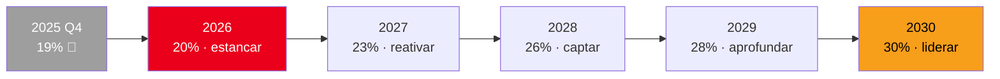
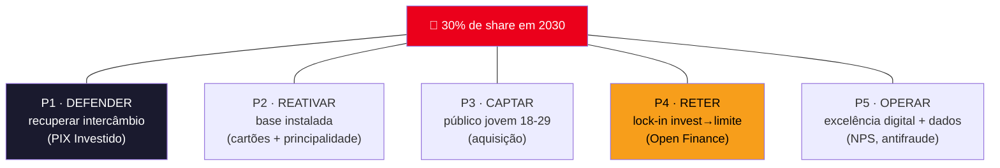
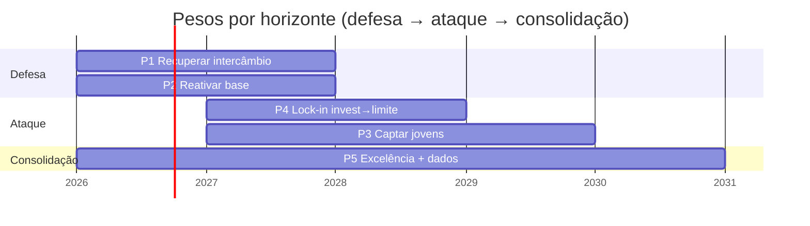

# Plano de Ação 5 Anos — **Retomada de Market Share**
### Priceless Bank | Mastercard Challenge 2026

> Plano estratégico 2026–2030 para reverter a queda de share e retomar a liderança.
> Ancorado no diagnóstico [`analise-exploratoria.md`](./analise-exploratoria.md) e no produto [`produto-pix-investido.md`](./produto-pix-investido.md).
> Data de referência dos dados: `2025-12-31`. Horizonte: `2026-01` → `2030-12`.

---

## 1. Onde estamos — o ponto de partida

O Priceless caiu de **33% → 19%** de market share em 2025 (−14 p.p. em 4 trimestres), enquanto o LuminaPay subiu de 17% → 30% e o Aurora quase dobrou (8% → 14%). A causa raiz não é uma só — são **cinco feridas abertas** que o diagnóstico expôs:

| # | Ferida | Evidência (dados) | Consequência |
|---|--------|-------------------|--------------|
| 1 | **Cartão migrando para PIX** | Cartão −75% (R$23,4M→R$5,9M/tri); PIX-PJ +446% (→R$17,9M/tri) | Intercâmbio em queda livre (~R$100k/tri) |
| 2 | **Base instalada subaproveitada** | 469 cartões nunca usados, 1.017 vencidos, 27% dos clientes sem atividade | Receita "na mesa" + churn silencioso |
| 3 | **Não captamos jovens** | 18-29 = 5,9% da base; e quando existem, fazem 3,7× mais PIX que cartão | Base envelhece sem renovação (idade média 49) |
| 4 | **Lock-in inexistente** | Investidores canibalizam o cartão igual a não-investidores (0,75 vs 0,74) | Reservinha é âncora *passiva* — não retém |
| 5 | **Fricção e cegueira de métrica** | 10% dos PIX reprovados; NPS e maturidade digital = "?" | Experiência ruim + não sabemos o quanto |

> **Tese do plano:** não existe bala de prata. A retomada exige **defender a receita atual** (curto prazo) **e** reconstruir os motores de crescimento e retenção (médio/longo prazo), em sequência deliberada.

---

## 2. A ambição — a North Star

**Voltar a 30% de market share em valor transacionado até 2030**, retomando a co-liderança com o LuminaPay — sem queimar margem, com o crescimento se autofinanciando.

| Métrica-farol | Hoje (2025Q4) | 2026 | 2028 | 2030 |
|---|---|---|---|---|
| **Market share (valor)** | 19% | 20% | 26% | **30%** |
| Intercâmbio / trimestre | ~R$ 100k | R$ 230k | R$ 400k | **R$ 550k** |
| % PIX-PJ convertido p/ crédito | 0% | 30% | 45% | **55%** |
| Clientes 18-29 (% da base) | 5,9% | 8% | 14% | **20%** |
| NPS | ? (medir) | 50 | 65 | **72** |
| Cartões inativos | 11,7% | 8% | 4% | **<3%** |

---

## 3. Os 5 pilares estratégicos

Cada ferida do diagnóstico vira um pilar com dono e métrica. Os pilares correm em paralelo, mas com **pesos diferentes por ano** (ver §4).

### P1 — Defender: recuperar o intercâmbio (o produto)
- **O quê:** lançar o **PIX Investido** (PIX no crédito com lastro de investimento + cashback que rende).
- **Por onde começar:** os **998 clientes** que já têm cartão de crédito ativo *e* mandam PIX-PJ — conversão de custo ~zero.
- **Meta de receita:** mesmo a 30% de conversão, +R$ 194k/tri líquido — já supera todo o intercâmbio atual do banco.
- **KPI:** % do volume PIX-PJ trafegando no trilho de crédito · receita líquida/tri.

### P2 — Reativar: a base que já temos
- **O quê:** "campanha de religação" — onboarding ativo dos 469 cartões nunca usados, renovação dos 1.017 vencidos, reengajamento dos 27% inativos.
- **Por quê:** é a receita mais barata que existe — o cliente já está dentro de casa.
- **KPI:** taxa de ativação pós-emissão · cartões inativos (%) · % clientes "banco principal".

### P3 — Captar: o público jovem (18-29)
- **O quê:** usar o flywheel do PIX Investido (cashback que rende + invest→limite) como **isca de aquisição** no terreno onde o LuminaPay vence.
- **Por quê:** hoje são 5,9% da base, mas movem 3,7× mais PIX que cartão — é o futuro do mercado, e estamos ausentes dele.
- **KPI:** CAC · novos clientes 18-29 · % da base nessa faixa.

### P4 — Reter: transformar investimento em lock-in
- **O quê:** **invest→limite** — saldo investido (≥R$1.000) vira limite extra de PIX-crédito (regra ilustrativa: +50% do saldo). Puxar saldo de fora via **Open Finance** e convertê-lo em limite.
- **Por quê:** os dados provam que a Reservinha hoje *não* retém. Sair do banco precisa passar a **custar limite** — foi assim que o Aurora quase dobrou de share.
- **KPI:** % da base com invest→limite ativo · saldo importado via Open Finance · churn dos clientes com lock-in.

### P5 — Operar: excelência digital, antifraude e dados
- **O quê:** derrubar a reprovação de PIX (10%→<3%), instituir medição de **NPS** e maturidade digital, e recuperar os **dados de consumo** que o PIX-PJ hoje apaga (alimentando scoring/ofertas).
- **Por quê:** sem medir NPS estamos cegos vs concorrentes (LuminaPay 76, Lux 82); cada PIX-PJ é receita *e* dado perdidos.
- **KPI:** taxa de reprovação PIX · NPS · cobertura de dados de consumo por cliente.

---

## 4. O roadmap ano a ano

### Ano 1 · 2026 — **Estancar a sangria** (foco P1 + P2)
*Objetivo: parar de cair e recuperar receita imediata com o que já temos.*
- Lançar PIX Investido em piloto nos 998 clientes prontos; medir conversão real e recalibrar premissas de receita com o time financeiro.
- Campanha de religação da base (cartões inativos/vencidos).
- **Instituir a medição de NPS e maturidade digital** (sair do "?").
- Quick-win operacional: investigar e reduzir a reprovação de PIX.
- **Meta:** share 19% → **20%** · intercâmbio ~R$100k → **R$230k/tri** · cartões inativos 11,7% → 8%.

### Ano 2 · 2027 — **Reativar e ancorar** (foco P2 + P4)
*Objetivo: virar o motor de retenção e aprofundar a principalidade.*
- Rollout pleno do invest→limite; integração Open Finance para importar saldo externo.
- Escalar PIX Investido para toda a base elegível (≈669 clientes do lock-in + novos).
- **Meta:** share 20% → **23%** · % PIX-PJ no crédito → 35% · primeiro NPS-alvo ~55.

### Ano 3 · 2028 — **Captar o futuro** (foco P3 + P4)
*Objetivo: atacar o LuminaPay no público jovem usando o diferencial que ele não tem.*
- Frente de aquisição 18-29 com o flywheel como proposta de valor; canais 100% digitais.
- Puxar via Open Finance os 62% de clientes do LuminaPay que exportam dados.
- **Meta:** share 23% → **26%** · 18-29 = 14% da base · NPS 65.

### Ano 4 · 2029 — **Aprofundar** (foco P3 + P5)
*Objetivo: consolidar a base nova e monetizar os dados recuperados.*
- Personalização e cross-sell baseados nos dados de consumo de volta no trilho de crédito.
- Expansão de portfólio premium/lifestyle para defender a faixa de alta renda (lição do Lux, NPS 82).
- **Meta:** share 26% → **28%** · reprovação PIX <3% · NPS 70.

### Ano 5 · 2030 — **Liderar** (consolidação dos 5 pilares)
*Objetivo: retomar a co-liderança e tornar o flywheel auto-sustentável.*
- Flywheel maduro: cashback→investimento→limite→gasto rodando sozinho.
- **Meta:** share **30%** · intercâmbio R$550k/tri · NPS 72.

---

## 5. Como vamos medir — painel executivo

| Pilar | KPI primário | Baseline | Meta 2030 | Cadência |
|---|---|---|---|---|
| Farol | Market share (valor) | 19% | **30%** | Trimestral |
| P1 | Intercâmbio recuperado / tri | R$ 100k | R$ 550k | Trimestral |
| P1 | % PIX-PJ no trilho de crédito | 0% | 55% | Mensal |
| P2 | Cartões inativos | 11,7% | <3% | Mensal |
| P2 | % clientes "banco principal" | ? | 40%+ | Trimestral |
| P3 | Clientes 18-29 (% base) | 5,9% | 20% | Trimestral |
| P3 | CAC do público jovem | — | ≤ benchmark | Mensal |
| P4 | Base com invest→limite ativo | 0% | 35% | Trimestral |
| P4 | Churn dos clientes com lock-in | — | < metade da base | Trimestral |
| P5 | Taxa de reprovação PIX | 10% | <3% | Mensal |
| P5 | NPS | ? | 72 | Trimestral |

---

## 6. Riscos e mitigação

| Risco | Probabilidade | Impacto | Mitigação |
|---|---|---|---|
| LuminaPay copia o invest→limite | Média | Alto | Esteira de investimento leva anos p/ construir — vantagem de tempo; aprofundar lock-in via Open Finance antes |
| Conversão do PIX Investido abaixo do piloto | Média | Alto | Começar pelos 998 prontos (CAC ~zero); plano se autofinancia já a 30% |
| Regulação do PIX/intercâmbio muda | Baixa | Alto | Receita diversificada (juros + dados), não só intercâmbio |
| Custo do cashback corrói margem | Média | Médio | Cashback vira investimento (não saldo solto) e é pago pelo intercâmbio+juros recuperados |
| Base premium não migra (inércia) | Média | Médio | Invest→limite dá ganho tangível (+68% de limite mediano) como gatilho |

---

## 7. Resumo executivo — em uma página

- **Problema:** 19% de share (era 33%), porque o consumo fugiu do cartão (−75%) para o PIX-PJ (+446%), que tem intercâmbio zero.
- **Ambição:** voltar a **30% em 2030**, com o crescimento se autofinanciando.
- **Como:** 5 pilares em sequência — **Defender** (PIX Investido recupera intercâmbio nos 998 clientes prontos) → **Reativar** (base instalada) → **Reter** (invest→limite vira lock-in) → **Captar** (jovens 18-29) → **Operar** (NPS, antifraude, dados).
- **Por que vence:** o Priceless é o **único** com as duas metades — base premium de cartão (motor de intercâmbio) *e* base investidora — ligadas pelo trilho de crédito. LuminaPay não tem investimentos; Aurora não tem músculo de cartão.
- **Sequência importa:** defesa primeiro (receita imediata, CAC zero), ataque depois (crescimento sobre uma base já estancada).

---

*Documento gerado em 13/06/2026. Premissas de share são metas de planejamento, calibráveis com o time de estratégia. Diagnóstico em [`analise-exploratoria.md`](./analise-exploratoria.md); produto em [`produto-pix-investido.md`](./produto-pix-investido.md).*
</content>
</invoke>
