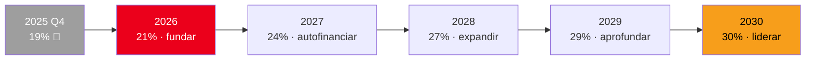
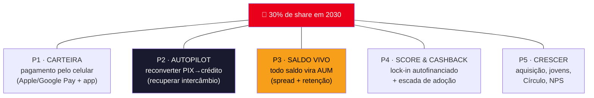
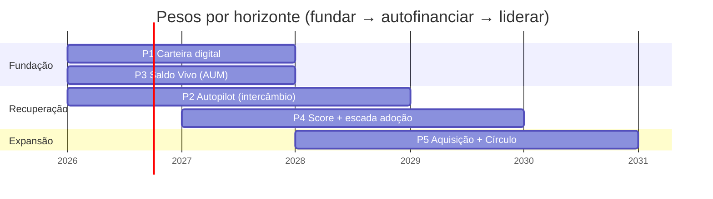
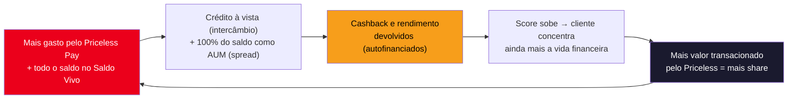

# Plano de Ação 5 Anos — **Retomar e Liderar o Market Share**
### Priceless Bank · Priceless Pay | Mastercard Challenge 2026

> Plano estratégico 2026–2030 para reverter a queda de share e retomar a liderança, executado **através do Priceless Pay**.
> Ancorado no diagnóstico [`analise-exploratoria.md`](./analise-exploratoria.md) e na solução [`propostas-solucao.md`](./propostas-solucao.md).
> Estende as Fases 0→1→2 da proposta (que cobrem o Ano 1) para um horizonte de cinco anos.
> Data de referência dos dados: `2025-12-31`. Horizonte: `2026-01` → `2030-12`.

---

## 1. Onde estamos — o ponto de partida

O Priceless caiu de **33% → 19%** de market share (valor transacionado) em 2025. A causa, em uma frase: **o valor migrou para o PIX cego** — um cano que o banco não monetiza (intercâmbio zero) e não enxerga (sem dado) — e, em paralelo, **a base esfriou**. As cinco evidências que o Priceless Pay ataca:

| # | Sintoma | Evidência (dados) | O que o Priceless Pay faz |
|---|--------|-------------------|---------------------------|
| 1 | **Fluxo vaza como PIX cego** | PIX-PJ explode; intercâmbio cai a ~R$100k/tri (oportunidade R$358k/tri) | Autopilot reconverte à-vista-PIX → crédito à vista |
| 2 | **Carteira digital parada** | 85,9% das transações **sem** wallet (adoção ~14%) | Provisiona credencial no Apple/Google Pay |
| 3 | **Dinheiro parado rende zero** | Resgate recorde de **R$1.632k** em 2025Q4; só a parte poupada rende | Saldo Vivo: 100% do saldo vira AUM |
| 4 | **Base esfriou** | 469 cartões nunca usados, 1.018 vencidos, 87 inativos, 85 contas-fantasma | Régua de reativação + Score |
| 5 | **Não captamos jovens / não medimos NPS** | 18-29 = 5,9% da base; NPS = "?" (benchmark Lux 82) | Aquisição por diferenciação + medir NPS |

> **Tese do plano:** não competimos pelo *instrumento* de pagamento (PIX no crédito, invest→limite — terreno dos concorrentes). Competimos pela **rotina do cliente** e pelo **ciclo econômico que se autofinancia** por trás dela. Quem é dono da rotina recupera o share — e depois lidera.

---

## 2. A ambição — a North Star

**Voltar a 30% de market share até 2030**, retomando a co-liderança — com o crescimento se autofinanciando (intercâmbio + spread de AUM pagam o cashback).

| Métrica-farol | Hoje (2025Q4) | 2026 | 2028 | 2030 |
|---|---|---|---|---|
| **Market share (valor)** | 19% | 21% | 27% | **30%** |
| Adoção de carteira digital | ~14% | 40% | 60% | **>70%** |
| Intercâmbio / trimestre | ~R$ 100k | R$ 200k | R$ 320k | **R$ 358k+** |
| AUM total (Saldo Vivo) | em fuga | estanca + cresce | dobra | **motor estável** |
| Cartões **ativos** por cliente | baseline | +10% | +25% | **+40%** |
| Clientes 18-29 (% da base) | 5,9% | 7% | 13% | **18%** |
| NPS | ? (medir) | 50 | 65 | **72** |

---

## 3. Os 5 pilares — a arquitetura do Priceless Pay vira estratégia

Cada componente do produto vira um pilar com métrica própria. Eles correm em paralelo, com **pesos diferentes por ano** (§4).

### P1 — Carteira: trazer o pagamento de volta para o trilho
- **O quê:** provisionar a credencial Priceless tokenizada no **Apple/Google Pay** e habilitar QR/PIX no app — sem maquininha nova.
- **Por quê:** 85,9% das transações não usam wallet hoje — é um oceano de adoção parada e a porta de entrada de todo o resto.
- **KPI:** % da base ativa no Priceless Pay · adoção de carteira digital.

### P2 — Autopilot: reconverter valor em receita
- **O quê:** o cérebro no backend que escolhe a melhor trilha (à vista que rende / crédito à vista / parcelado) e migra suavemente o à-vista-PIX → crédito à vista.
- **Por quê:** cada transação reconvertida recupera intercâmbio (rumo aos R$358k/tri de oportunidade) **e** recupera o dado de consumo.
- **KPI:** intercâmbio recuperado/tri · % do fluxo PIX-PJ retido no ecossistema.

### P3 — Saldo Vivo: transformar saldo em AUM (o motor invisível)
- **O quê:** todo o saldo do cliente rende por padrão (liquidez diária, FGC), e todo pagamento varre no último segundo.
- **Por quê:** estanca a fuga de AUM (resgate recorde de R$1.632k em 2025Q4) e transforma 100% do saldo — não só a parte poupada — em **spread recorrente**, fonte que pode igualar o intercâmbio.
- **KPI:** AUM total · queda nos resgates · adesão ao Saldo Vivo.

### P4 — Score & Cashback: o lock-in que se autofinancia
- **O quê:** o Score Priceless mede a concentração da vida financeira no banco e destrava cashback/perks escalonados; alimenta a **escada de adoção** (cross-sell lastreado no gasto real) para o segmento de 1–2 cartões (49% da base, ~959 clientes).
- **Por quê:** cashback que cresce com o relacionamento fideliza; cada cartão de crédito **ativo** a mais alimenta o motor de intercâmbio.
- **KPI:** Score médio da base · **cartões ativos por cliente** (não emitidos) · cashback devolvido vs intercâmbio (autofinanciamento).

### P5 — Crescer: reter, adquirir e medir
- **O quê:** régua de reativação/renovação (469 parados, 1.018 vencidos, 87 inativos), rede de comerciantes de bairro (**Círculo**), aquisição por diferenciação e captação do público 18-29.
- **Por quê:** depois de estancar, é hora de ganhar — e de finalmente medir NPS (hoje "?") para mirar o topo (Lux = 82).
- **KPI:** ganho líquido de share · novos clientes (e % 18-29) · cartões reativados/renovados · NPS.

---

## 4. O roadmap ano a ano

O Ano 1 executa as **Fases 0→1→2** da proposta. Os anos seguintes escalam o motor de composição.

### Ano 1 · 2026 — **Fundar e estancar** (Fases 0→1→2 · foco P1 + P3)
*Objetivo: parar de sangrar e ligar o motor.*
- **Fase 0 (0–3m):** provisionar wallet (resolver os 14% de adoção); lançar **Saldo Vivo** (estanca a fuga de AUM na raiz); **Autopilot v1** (crédito-à-vista × débito/PIX); **Score v1**.
- **Fase 1 (3–6m):** cashback por score → migração à-vista-PIX → crédito à vista (recuperar intercâmbio); **renovação proativa** dos cartões vencendo e **reativação** dos 469 parados; reconquista dos 87 inativos e das 85 contas-fantasma.
- **Fase 2 (6–12m):** primeiros passos da escada de adoção (segmento 1–2 cartões); medir NPS.
- **Meta:** share 19% → **21%** · wallet 14% → 40% · intercâmbio R$100k → R$200k/tri · resgates em queda.

### Ano 2 · 2027 — **Autofinanciar** (foco P2 + P4)
*Objetivo: o ciclo cashback→score→concentração passa a girar sozinho.*
- Autopilot maduro (três faixas, proteção contextual); cashback por score escalado, **pago pelo intercâmbio + spread de AUM**.
- Escada de adoção em ritmo: cross-sell lastreado em dado, métrica = **cartões ativos por cliente**.
- **Meta:** share 21% → **24%** · wallet 50% · AUM crescente e estável · NPS ~58.

### Ano 3 · 2028 — **Expandir** (foco P5 + P2)
*Objetivo: depois de estancar, ganhar share novo.*
- **Rede do Círculo** (comerciantes de bairro) → fidelidade de dois lados + aquisição via parceiros.
- Aquisição por diferenciação ("seu dinheiro rende até a hora de pagar"); captação do público 18-29 com o Priceless Pay como porta de entrada.
- **Meta:** share 24% → **27%** · wallet 60% · 18-29 = 13% da base · NPS 65.

### Ano 4 · 2029 — **Aprofundar e monetizar** (foco P4 + P3)
*Objetivo: extrair valor da concentração conquistada.*
- Escalar a assinatura **Priceless Pay Black** (autofinanciada, "se paga sozinha"); personalização e cross-sell com os dados de consumo recuperados.
- Defender a faixa de alta renda com perks de lifestyle (lição do Lux, NPS 82).
- **Meta:** share 27% → **29%** · cartões ativos/cliente +30% · NPS 70.

### Ano 5 · 2030 — **Liderar** (consolidação dos 5 pilares)
*Objetivo: o flywheel maduro torna o share auto-sustentável.*
- Ciclo completo girando: mais gasto no Pay → mais intercâmbio + AUM → mais cashback/rendimento → Score sobe → mais concentração.
- **Meta:** share **30%** · intercâmbio R$358k+/tri · NPS 72 · co-liderança com o LuminaPay.

---

## 5. O motor econômico — por que isso vira liderança, não só recuperação

Cada volta do ciclo **aumenta o valor transacionado intermediado pelo Priceless** — que é exatamente a métrica do market share. Não é campanha pontual; é máquina de composição. As **duas maiores fontes de receita são invisíveis para o cliente** (spread de AUM + intercâmbio do lojista), o que permite a manchete "zero anuidade, zero tarifa" sem deixar de faturar.

---

## 6. Como vamos medir — painel executivo

| Pilar | KPI primário | Baseline | Meta 2030 | Cadência |
|---|---|---|---|---|
| Farol | Market share (valor) | 19% | **30%** | Trimestral |
| P1 | Adoção de carteira digital | ~14% | >70% | Mensal |
| P2 | Intercâmbio recuperado / tri | R$ 100k | R$ 358k+ | Trimestral |
| P2 | % fluxo PIX-PJ retido no ecossistema | ~0% | maioria | Mensal |
| P3 | AUM total (Saldo Vivo) | em fuga | motor estável | Mensal |
| P3 | Resgates / tri | recorde 2025Q4 | normalizado | Trimestral |
| P4 | Cartões **ativos** por cliente | baseline | +40% | Trimestral |
| P4 | Cashback ÷ (intercâmbio+spread) | — | <100% (autofin.) | Trimestral |
| P5 | Clientes 18-29 (% base) | 5,9% | 18% | Trimestral |
| P5 | NPS | ? | 72 | Trimestral |

---

## 7. Riscos e mitigação

| Risco | Probabilidade | Impacto | Mitigação |
|---|---|---|---|
| Adoção da carteira/Saldo Vivo trava (inércia da persona) | Média | Alto | Opt-in com mensagem de capital preservado + FGC; valor sentido a cada pagamento ("paguei do Black: +R$2,40") |
| Concorrente copia o Autopilot | Média | Médio | A barreira não é o roteador, é o **ciclo de dados + AUM + Score** acumulado — composição leva anos |
| Pagamento falha por "dinheiro investido" | Baixa | Alto | Banco fronta a liquidação com camada-tampão de liquidez; reconcilia por trás |
| Cashback corrói margem | Média | Médio | Cashback **autofinanciado** pelo intercâmbio recuperado + spread de AUM |
| Empurrar cartões sem uso (repetir o erro dos 469 parados) | Média | Médio | Métrica é cartão **ativo**, não emitido; escada puxada por valor, junto da régua de ativação |
| Regulação do intercâmbio muda | Baixa | Alto | Receita diversificada: spread de AUM + assinatura + juros, não só intercâmbio |

---

## 8. Resumo executivo — em uma página

- **Problema:** 19% de share (era 33%), porque o valor fugiu para o **PIX cego** (intercâmbio zero, sem dado) e a base esfriou.
- **Ambição:** voltar a **30% em 2030**, com o crescimento se autofinanciando.
- **Como:** o **Priceless Pay** executado em 5 pilares — **Carteira** (trazer o pagamento pro trilho) → **Autopilot** (reconverter PIX→crédito = intercâmbio) → **Saldo Vivo** (todo saldo vira AUM = spread + retenção) → **Score & Cashback** (lock-in autofinanciado + escada de adoção) → **Crescer** (aquisição, jovens, Círculo, NPS).
- **Sequência:** Ano 1 funda e estanca (Fases 0→1→2); Anos 2–3 autofinanciam e expandem; Anos 4–5 aprofundam e lideram.
- **Por que vence:** os concorrentes disputam o *instrumento* de pagamento; o Priceless Pay disputa a **rotina do cliente** e roda um **ciclo econômico que se paga sozinho**. Sem maquininha nova, sobre o Apple Pay e o PIX que já existem.

---

*Documento gerado em 13/06/2026. Premissas de share são metas de planejamento, calibráveis com o time de estratégia. Diagnóstico em [`analise-exploratoria.md`](./analise-exploratoria.md); solução em [`propostas-solucao.md`](./propostas-solucao.md).*
</content>
