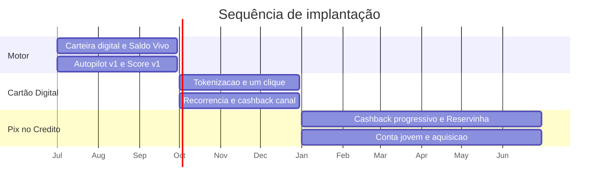
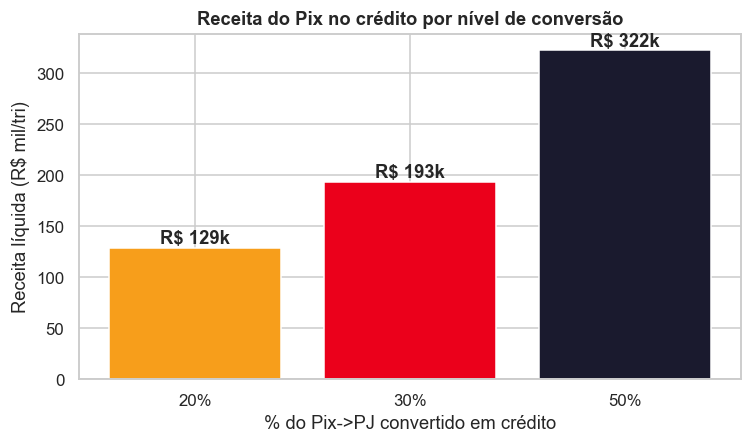
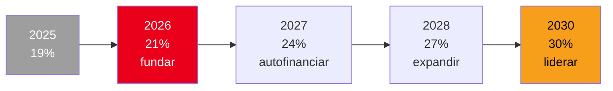

# Plano de Ação
**Recuperar e ganhar market share · Mastercard Challenge 2026**

---

## 1. A lógica do plano

Perdemos market share por dois motivos juntos. O dinheiro migrou para o Pix, que tem intercâmbio zero e sai dos nossos trilhos, e a base esfriou (clientes parados, cartões vencidos, gente resgatando investimento).

O plano ataca os dois ao mesmo tempo, e numa ordem pensada: primeiro o motor, que estanca a sangria, e depois os dois produtos, que voltam a crescer.

---

## 2. O roadmap dos 12 meses

### Fase 0 · O motor (meses 0 a 3): parar de sangrar

A ideia é ligar o motor sem depender de produto novo, usando o que o cliente já tem.

- Colocar o cartão na carteira digital (Apple Pay e Google Pay) para resolver os 14% de adoção.
- Lançar o Saldo Vivo, que faz todo o saldo render e estanca a fuga de investimento na raiz (lembrando do resgate recorde de R$ 1.632 mil em 2025Q4).
- Subir a primeira versão do Autopilot, com a lógica de crédito à vista contra débito e Pix.
- Subir a primeira versão do Score Priceless.

**Como medir:** quanto da base já está ativa no Priceless Pay, quanto do Pix PJ ficou dentro do ecossistema e a queda nos resgates.

### Fase 1 · Cartão Digital (meses 3 a 6): crescer onde o Pix não vai

- Pagamento em um clique e cartão na carteira digital nos maiores e-commerces.
- Cartão virtual com controle de gastos, para tirar o medo de fraude no online.
- Central de assinaturas, aproveitando os 9.262 recorrentes que já existem.
- Cashback maior nos canais digitais, no internacional e nas assinaturas.
- Em paralelo, reativar os 469 cartões parados e renovar de forma proativa os que estão vencendo.

**Como medir:** adoção de carteira digital, fatia do volume que roda online e cartões ativos por cliente (não cartões emitidos, e sim ativos).

### Fase 2 · Pix no Crédito e jovem (meses 6 a 12): ganhar share novo

- Cashback progressivo (1%, 2%, 3%) caindo direto na Reservinha.
- Conta jovem 100% digital, com Pix no crédito ativo no dia 1.
- Reservinha como âncora de limite, no laço cashback, Reservinha, mais limite.
- Campanha de aquisição focada no público de 18 a 29 anos, que hoje é só 5,9% da base.

**Como medir:** volume de Pix PJ convertido em crédito, novos clientes jovens, saldo na Reservinha e NPS (a meta é mirar o topo do mercado, já que o Lux tem NPS 82).

---

## 3. Quanto isso recupera

Primeiro, o tamanho da perda. A virada do cartão para o Pix custa cerca de **R\$ 1,49 milhão por ano**, somando duas coisas: a queda do intercâmbio de cartão (R\$ 216 mil) e, principalmente, o intercâmbio que evapora no Pix PJ (R$ 1,27 milhão).

Agora a recuperação. Como a plataforma é gratuita, a receita vem de três fontes que não cobram nada do cliente: intercâmbio recuperado, spread sobre o saldo aplicado e juros do parcelado. Montamos três cenários, do mais cauteloso ao mais otimista.

| Fonte de receita nova por ano | Pessimista | Neutro | Otimista |
|---|---:|---:|---:|
| Intercâmbio recuperado | R$ 95,6 mil | R$ 286,7 mil | R$ 538,3 mil |
| Spread sobre o saldo (Saldo Vivo) | R$ 35,3 mil | R$ 185,2 mil | R$ 614,7 mil |
| Juros do parcelado (Pix no crédito) | R$ 11,9 mil | R$ 89,4 mil | R$ 302,2 mil |
| **Total por ano** | **R$ 143 mil** | **R$ 561 mil** | **R$ 1,46 milhão** |
| **Quanto repõe da perda** | **10%** | **38%** | **98%** |

Olhando só a parte do Pix no crédito, dá para ver como a conversão move o resultado: converter 20%, 30% ou 50% do Pix PJ gera, respectivamente, R\$ 129 mil, R\$ 193 mil e R$ 322 mil líquidos por trimestre.

*Quanto mais Pix PJ convertido em crédito, maior a receita líquida por trimestre.*

A leitura que fica: mesmo sem cobrar nada do cliente, a solução já repõe boa parte da perda no cenário neutro, e quase toda ela no otimista. A fonte de maior potencial é o saldo aplicado, porque é recorrente e o banco não tinha antes.

---

## 4. O motor econômico

Vale repetir por que isso vira liderança, e não só recuperação. Cada peça alimenta a próxima:

As duas maiores fontes de receita (o spread sobre o saldo e o intercâmbio) são invisíveis para o cliente. Por isso dá para anunciar "zero anuidade, zero tarifa" sem deixar de faturar.

---

## 5. Para onde isso leva (visão de 5 anos)

O ano 1 funda e estanca. Os anos seguintes deixam o ciclo girar e ganhar força.

| Indicador | Ponto de partida (2025Q4) | 2026 | 2028 | 2030 |
|---|---|---|---|---|
| Market share (valor) | 19% | 21% | 27% | 30% |
| Adoção de carteira digital | cerca de 14% | 40% | 60% | acima de 70% |
| Intercâmbio por trimestre | cerca de R$ 100 mil | R$ 200 mil | R$ 320 mil | R$ 358 mil ou mais |
| Clientes de 18 a 29 anos | 5,9% | 7% | 13% | 18% |
| NPS | a medir | 50 | 65 | 72 |

---

## 6. Painel de KPIs

| Camada | O que acompanhar | Ponto de partida (2025Q4) | Meta |
|---|---|---|---|
| Farol | Market share em valor | 19% | 30% |
| Motor | Adoção de carteira digital | cerca de 14% | acima de 70% |
| Motor | Intercâmbio por trimestre | cerca de R$ 100 mil | R$ 358 mil ou mais |
| Motor | Saldo aplicado (Saldo Vivo) | em fuga | crescente e estável |
| Cartão Digital | Cartões ativos por cliente | base atual | mais 40% |
| Pix no Crédito | Volume de Pix PJ convertido | quase zero | a maior parte |
| Pix no Crédito | Clientes de 18 a 29 anos | 5,9% | 18% |
| Todos | NPS | a medir | 72 |

---

## 7. Riscos e como lidamos

| Risco | Chance | Impacto | Como reduzimos |
|---|---|---|---|
| A adesão à carteira e ao Saldo Vivo trava | média | alto | ativação opcional, com mensagem clara de capital preservado e FGC, e valor sentido a cada pagamento |
| Um concorrente copia o Autopilot | média | médio | a barreira não é o roteador, é o ciclo de dados, saldo e Score que leva anos para montar |
| Um pagamento falha por causa do "dinheiro investido" | baixa | alto | o banco adianta a liquidação com uma reserva de liquidez e acerta as contas por trás |
| O cashback corrói a margem | média | médio | o cashback é financiado pelo próprio intercâmbio recuperado e pelo spread do saldo |
| Empurrar cartões sem uso, repetindo o erro dos 469 parados | média | médio | a métrica é cartão ativo, não emitido, e a oferta só aparece quando faz sentido para o cliente |
| A regra do intercâmbio muda | baixa | alto | a receita é diversificada (saldo aplicado, parcelado e assinatura), não depende só do intercâmbio |

---

## 8. Resumo em uma página

- **Problema:** caímos de 33% para 19% de share porque o dinheiro foi para o Pix (que o banco não monetiza nem enxerga) e a base esfriou.
- **Solução:** um motor (Autopilot e Saldo Vivo) que reage à queda, mais dois produtos (Cartão Digital e Pix no Crédito) que voltam a crescer.
- **Sequência:** o motor primeiro, porque estanca a sangria sem depender de produto novo. Depois o Cartão Digital, que cresce onde o Pix não vai. Por fim o Pix no Crédito, que captura o fluxo onde o Pix já está.
- **Números:** a perda é de cerca de R$ 1,49 milhão por ano, e só a parte gratuita da solução repõe de 38% (neutro) a 98% (otimista) disso.
- **Por que vencemos:** os concorrentes brigam pelo meio de pagamento. A gente briga pela rotina do cliente, com um ciclo de dinheiro que se paga sozinho. Sem maquininha nova, em cima do Apple Pay e do Pix que já existem.

