# Proposta de Solução
**Priceless Bank · Mastercard Challenge 2026**

---

## 1. O problema, em poucas linhas

O Priceless Bank caiu de **33% para 19% de participação de mercado** em apenas quatro trimestres de 2025. A explicação é direta: o dinheiro que antes passava no cartão começou a passar pelo Pix.

Três fatos resumem a situação:

- O volume de cartão caiu **75%** (de R\$ 23,4 milhões em 2024Q4 para R$ 5,9 milhões em 2025Q4).
- O Pix para empresas (Pix PJ) ficou **3,4 vezes maior** que todo o volume de cartão em 2025Q4.
- A base esfriou: 469 cartões nunca usados, 1.018 vencidos sem renovação, 87 clientes inativos e um recorde de resgates de investimento (R$ 1.632 mil em 2025Q4).

O Pix venceu no balcão porque é grátis para o lojista e instantâneo. O problema é que, para o banco, cada pagamento que vira Pix some duas vezes: some a receita de intercâmbio e some o dado de consumo.

---

## 2. A ideia central: um motor e dois produtos

Em vez de uma única jogada, a solução tem três camadas que trabalham juntas. Primeiro um **motor**, que faz o banco reagir à queda na hora. Em cima dele, **dois produtos**, cada um cuidando de um lado da virada.

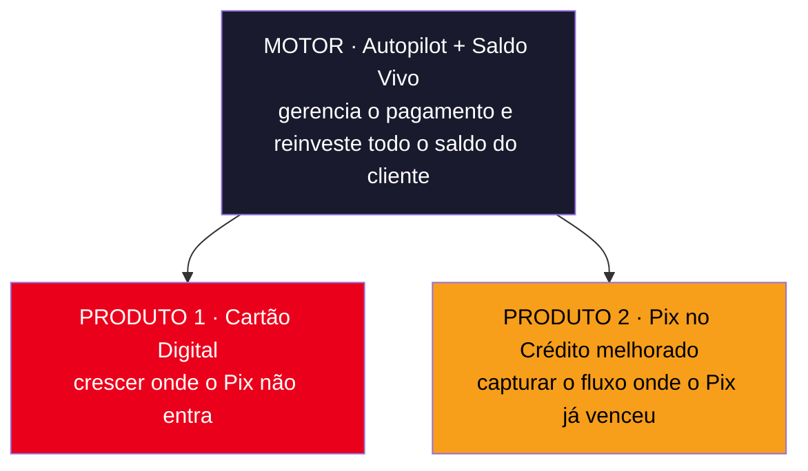

A lógica da ordem é simples:

- O **motor** vem primeiro porque ele reage à queda sem depender de nenhum produto novo. Ele roda em cima do que o cliente já tem (o celular, o cartão e o Pix).
- O **Cartão Digital** recupera o que o Pix nunca vai conseguir tomar (compras online, internacionais e assinaturas).
- O **Pix no Crédito** recupera justamente o que o Pix já tomou (o pagamento no comércio do dia a dia).

---

## 3. Nossa cliente: a Helena

Para não falar no abstrato, pensamos na Helena. Ela tem 52 anos, mora em São Paulo e ganha cerca de R$ 90 mil por ano. Tem cartão Platinum, Black e débito, e guarda um dinheiro na Reservinha.

A rotina dela é movimentada: café na padaria de manhã, almoço perto do trabalho, farmácia, mercado no sábado. São mais ou menos três pagamentos por dia, quase tudo à vista, misturando Pix (nas compras pequenas) e cartão (nas maiores). A Helena é cuidadosa e detesta perder dinheiro à toa, mas não tem tempo de ficar escolhendo o melhor jeito de pagar a cada compra. Então ela paga no que está à mão e deixa benefício na mesa.

A solução foi desenhada para ela: o banco cuida dessas escolhas no lugar dela, sempre com as regras que ela mesma definiu.

---

## 4. O motor: Autopilot e Saldo Vivo

O motor transforma o celular da Helena na carteira inteligente do Priceless. Ela paga uma vez, do jeito mais simples (Apple Pay, Google Pay ou pelo app), e o banco faz o resto acontecer por trás. Nada de maquininha nova: tudo roda sobre os trilhos que já existem.

### Autopilot, o cérebro do pagamento

A cada compra, o Autopilot decide em milésimos de segundo qual a melhor forma de pagar. Ele olha três caminhos:

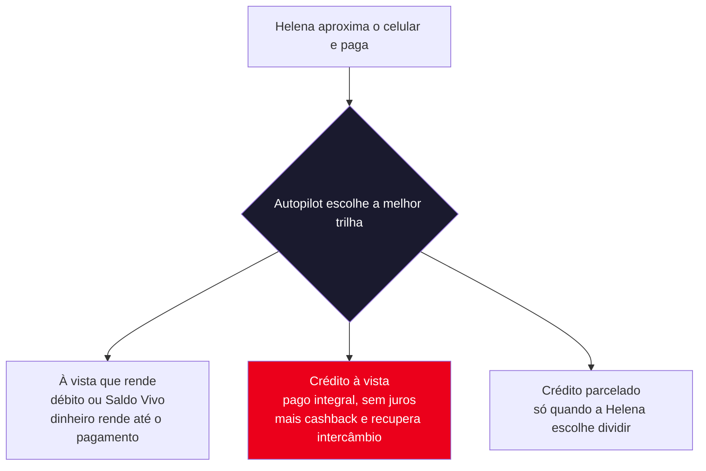

O ponto importante: o banco só sugere a melhor opção, mas quem decide é sempre a cliente. Ela pode configurar regras como "mercado sempre no débito" ou "nunca parcele", e o Autopilot trabalha dentro delas. O lema é "você no comando, o Autopilot no volante".

### Saldo Vivo, o coração da solução

Hoje a Helena deixa dinheiro parado na conta corrente rendendo zero. No Saldo Vivo, isso acaba. Por padrão, **todo o saldo dela fica rendendo** em aplicações de baixo risco e liquidez diária (Reservinha, Tesouro Selic, CDB com FGC). Quando ela paga algo, o sistema resgata o valor no último segundo, de forma automática e invisível.

O resultado é que o dinheiro está sempre trabalhando, não só a parte que ela lembrou de poupar. Para o banco, isso transforma 100% do saldo do cliente em recurso aplicado, que gera uma receita nova e estável.

### Por que o motor já é a reação à queda

O motor recupera de uma vez os três pontos que estavam vazando: o **dado** de consumo volta para o banco, o **intercâmbio** volta a ser faturado e o **saldo** vira aplicação. E ele faz isso girar num ciclo que se paga sozinho:

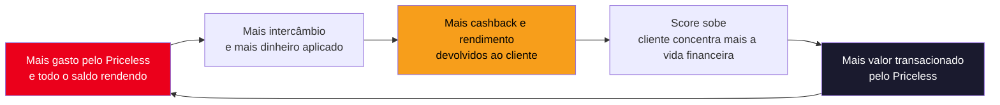

Cada volta desse ciclo aumenta o valor que passa pelo banco, que é exatamente a conta do market share. Não é uma campanha pontual, é uma máquina que se realimenta.

---

## 5. Produto 1: Cartão Digital

A tese aqui é honesta: o Pix já venceu no presencial, e brigar por esse terreno é correr atrás do prejuízo. O caminho é crescer o cartão onde o Pix, por desenho, não consegue entrar.

### Por que não competir no balcão

70% do valor do cartão vive no presencial, justo a fatia que o Pix está comendo. E essa migração não é de um grupo só: em todas as idades, cerca de 60% do Pix vai para empresas. Não existe um cantinho do balcão "protegido" para defender.

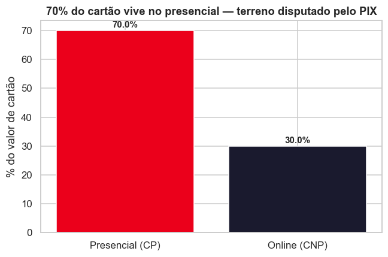
*70% do valor do cartão é presencial, que é a fatia disputada e perdida para o Pix.*

### Onde o cartão é imbatível

O Pix é doméstico, em tempo real e não tem volta. Por causa disso, existem quatro contextos em que o cartão é a melhor opção, ou a única:

| Território onde o Pix não entra | Motivo |
|---|---|
| Compras internacionais | o Pix só funciona em reais, dentro do Brasil |
| Compras online (e-commerce) | checkout salvo, compra em um clique |
| Assinaturas e recorrência | cobrança automática todo mês |
| Proteção ao comprador | o Pix não tem estorno em caso de problema |

A maior oportunidade está parada na mesa. Só **14% das transações** usam carteira digital hoje, então sobram 86% de espaço para crescer. E 30% do valor do cartão já roda online, que é a base segura para construir em cima.

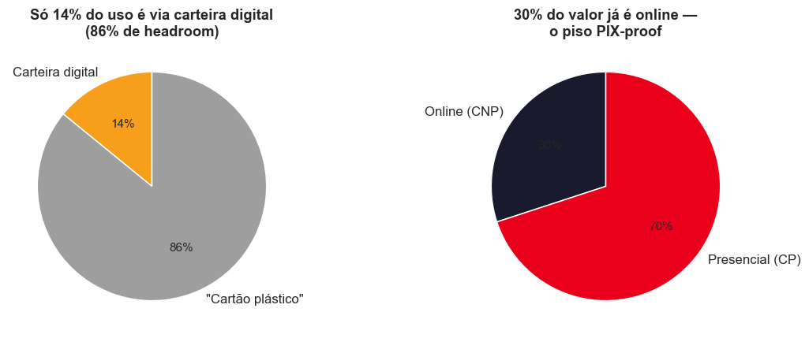
*Só 14% do uso é em carteira digital e 30% do valor já é online, o nosso piso seguro contra o Pix.*

A recorrência merece atenção especial. Já existem **9.262 transações recorrentes** na base, ou seja, receita que se repete todo mês e que o Pix avulso não captura.

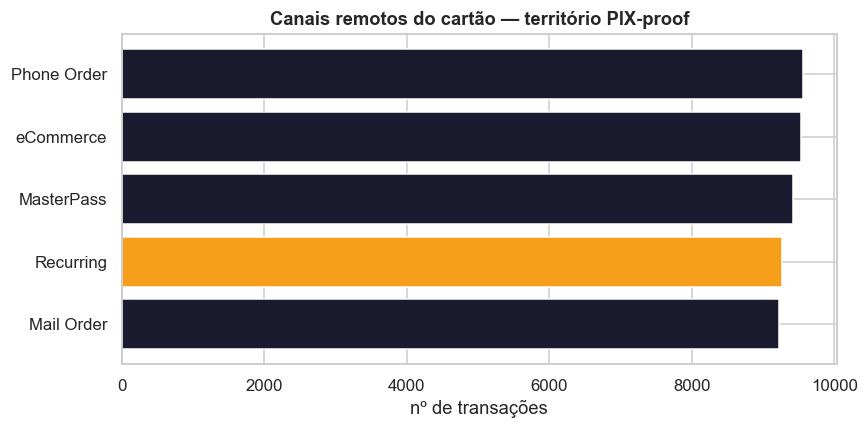
*Os canais remotos já são 30% do cartão, e os 9.262 recorrentes são receita previsível.*

### As alavancas para crescer no online

Crescer aqui não é torcer para acontecer. São movimentos concretos:

| Alavanca | Como ganha do Pix no online | Apoio nos dados |
|---|---|---|
| Cartão na carteira digital e pagamento em um clique | menos esforço que escanear um QR a cada compra | hoje a carteira é só 14%, sobra 86% |
| Cartão virtual com controle de gastos | tira o medo de fraude, que mora no online | online já é 30% do volume |
| Central de assinaturas | cobrança automática é o padrão do cartão | já temos 9.262 recorrentes |
| Benefícios em compra internacional | o Pix simplesmente não existe lá fora | base é 54% Platinum e Black |
| Cashback maior nos canais digitais | recompensa que muda o comportamento | financiado pelo próprio intercâmbio |

O motor de tudo isso é o cashback escalonado por canal, mais alto no online, no internacional e nas assinaturas. Quem executa essa regra na prática é o Autopilot, lá da camada do motor.

> Vale registrar com transparência: esses incentivos são uma aposta estratégica. Os dados internos não trazem a sensibilidade do cliente a cada nível de cashback, então o tamanho exato de cada alavanca precisa ser calibrado com um piloto.

---

## 6. Produto 2: Pix no Crédito melhorado

O LuminaPay, que mais cresceu em 2025, tem "Pix no crédito" como diferencial. Foi um dos principais motivos da nossa perda. A nossa versão não é só copiar e deixar o cliente parcelar um Pix. É um produto que transforma cada Pix em comércio numa porta de entrada para fidelidade e investimento.

### O tamanho da oportunidade

Em 2025Q4, dos R\$ 34,1 milhões enviados em Pix, R\$ 19,9 milhões foram para empresas e R$ 17,9 milhões foram aprovados. Esse é o mercado que dá para endereçar.

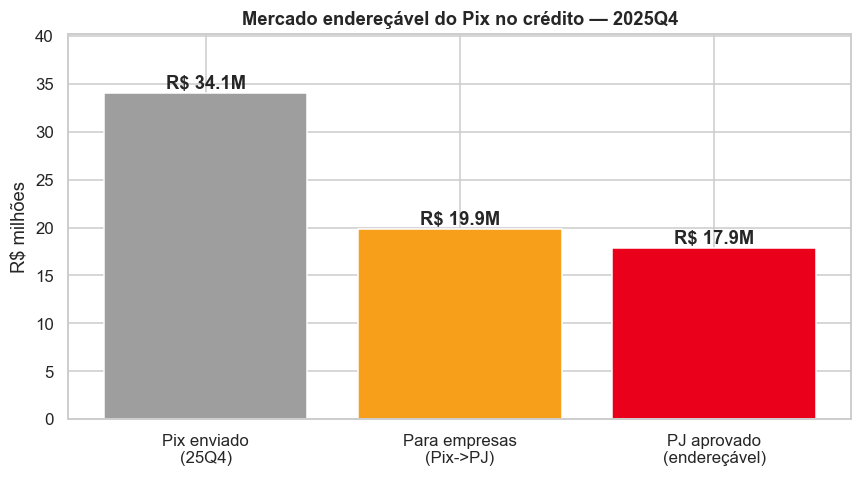
*Do Pix enviado, a parte que vai para empresas e é aprovada chega a R$ 17,9 milhões por trimestre.*

E não é um fluxo de compras miúdas. **69% do volume de Pix PJ** tem ticket de R$ 500 ou mais, justo a faixa em que faz sentido oferecer crédito.

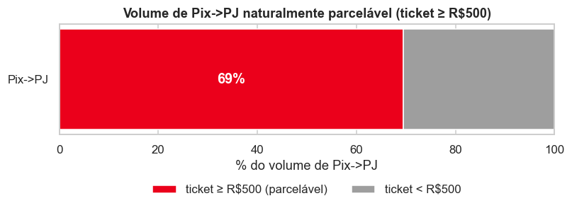
*A maior parte do valor de Pix PJ está em tickets de R$ 500 ou mais, naturalmente parcelável.*

### A base já está pronta

A melhor parte: o custo para conquistar esse cliente é perto de zero, porque ele já está dentro de casa. Dos 1.430 clientes que mandam Pix para empresas, **998 (70%) já têm cartão de crédito ativo**. E o público jovem, que é o que mais usa o digital, movimenta R$ 68 mil de Pix PJ por cliente, quase o dobro das outras faixas (R$ 36 a 45 mil).

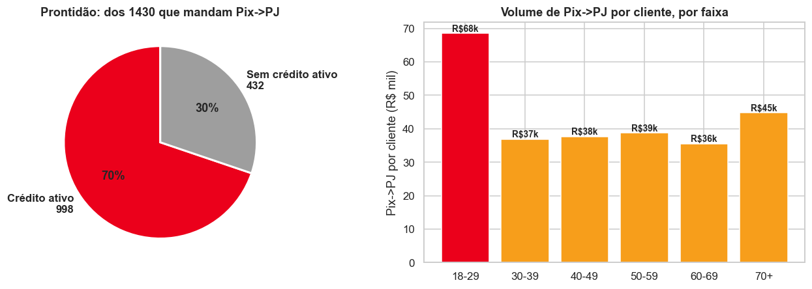
*Sete em cada dez clientes que mandam Pix PJ já têm crédito ativo, e o jovem 18 a 29 movimenta R$ 68 mil por pessoa.*

### As três frentes

**Frente 1 · Cashback progressivo que vira investimento.** Quanto mais o cliente usa o Pix no crédito, maior o cashback: começa em 1%, sobe para 2% e chega a 3%. E o cashback cai automaticamente na Reservinha, criando o hábito de investir desde o primeiro Pix, sem nenhum esforço.

**Frente 2 · Conta jovem 100% digital.** Abertura com CPF e selfie, e o Pix no crédito já ativado no dia 1. Essa frente ataca a maior lacuna da base, já que o jovem de 18 a 29 anos é só 5,9% dos clientes. É exatamente o público que o LuminaPay conquista e que mais movimenta Pix por pessoa.

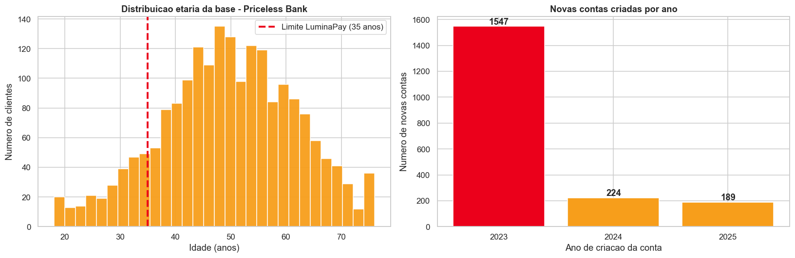
*A base está concentrada acima dos 40 anos, e a abertura de contas novas despencou (1.547 em 2023 para 189 em 2025).*

**Frente 3 · Reservinha como âncora de limite.** Aqui está o laço que segura o cliente: o cashback engorda a Reservinha, e o saldo da Reservinha vira mais limite de Pix no crédito. Quanto mais ele usa, mais saldo acumula e mais limite ganha. Sair do banco passa a significar perder esse limite.

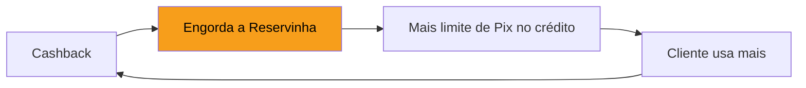

O número apoia a ideia: **634 clientes já têm saldo suficiente** (acima de R\$ 1 mil) na Reservinha e cartão para servir de lastro, e o limite médio deles poderia saltar de R\$ 43,6 mil para R$ 79,5 mil.

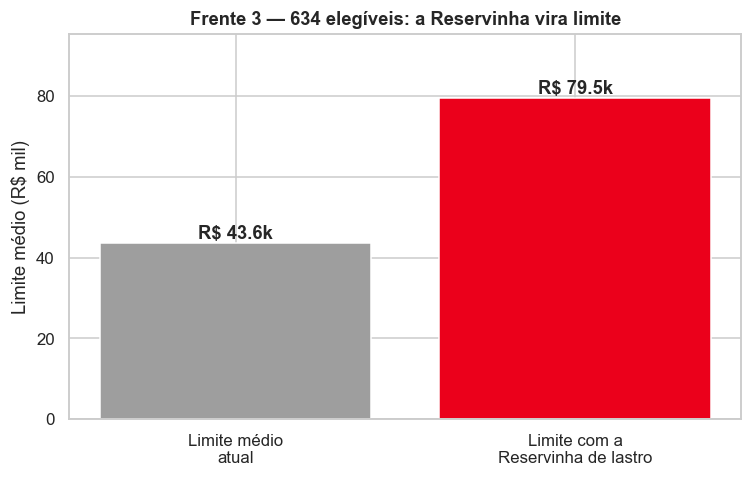
*Com a Reservinha como lastro, o limite médio dos elegíveis quase dobra, de R$ 43,6 mil para R$ 79,5 mil.*

---

## 7. Como o banco ganha dinheiro

A decisão é que **a plataforma é gratuita para o cliente**. Sem anuidade, sem mensalidade, sem tarifa. Isso não briga com lucro, porque a maior parte da receita não sai do bolso do cliente:

| Fonte de receita | Quem paga | Papel |
|---|---|---|
| Spread sobre o saldo aplicado (Saldo Vivo) | margem da gestão, o cliente só vê o rendimento | motor principal, recorrente |
| Intercâmbio | o lojista, pela maquininha, sem custo para o cliente | financia o cashback |
| Juros e IOF do parcelado | só quem escolhe parcelar | receita do crédito |
| Plano premium (opcional) | o cliente, se quiser benefícios extras | um bônus, não é necessário |

A escolha pelo gratuito tem um motivo claro: o que mais move o resultado é a adesão. Quanto mais gente usa, mais giram os dois motores invisíveis (intercâmbio e saldo aplicado). Cobrar mensalidade afastaria gente e renderia pouco. Sai mais caro do que vale.

A frase que resume a marca: "os outros bancos ganham quando você gasta demais ou se endivida. A gente ganha quando você nos acha úteis, e nunca cobra de você."

---

## 8. O que esperamos como resultado

| Indicador | Ponto de partida (2025Q4) | Meta |
|---|---|---|
| Adoção de carteira digital | cerca de 14% | acima de 60% |
| Fluxo do dia a dia dentro do Priceless | vaza como Pix cego | a maior parte dos Pix |
| Intercâmbio recuperado | cerca de R$ 100 mil por trimestre | rumo aos R$ 358 mil de oportunidade |
| Saldo aplicado (Saldo Vivo) | em fuga, com resgate recorde | todo o saldo virando aplicação |

Os números completos da recuperação de receita, com três cenários, estão no [`plano-de-acao.md`](plano-de-acao.md).

---

## 9. Por que isso nos torna líderes

Os concorrentes disputam o meio de pagamento (o Pix no crédito, o investimento que vira limite). O Priceless disputa uma coisa que ninguém olha: a inteligência que cuida da rotina do cliente e o ciclo de dinheiro que se paga sozinho por trás dela.

A Helena não escolhe um meio de pagamento. Ela escolhe um banco que cuida do dinheiro dela melhor do que ela mesma cuidaria, em cada um dos três pagamentos do dia. E quem é dono da rotina recupera o share primeiro, e depois lidera.
