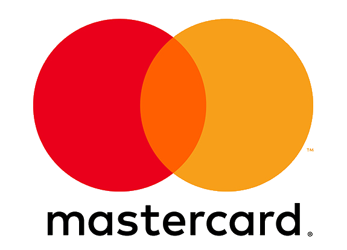
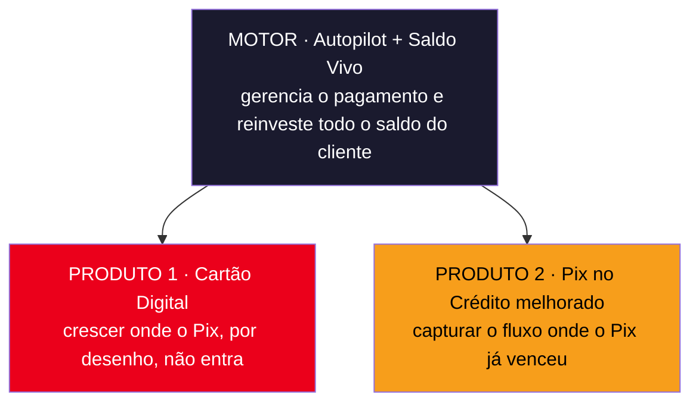

<p align="center">
  
  &nbsp;&nbsp;&nbsp;<b><sub>×</sub></b>&nbsp;&nbsp;&nbsp;
  
</p>

<p align="center"><b>Mastercard × Mastercaras</b>

---

# Os Mastercaras · Priceless Bank
**Mastercard Challenge 2026 · Inteli**

> Diagnóstico orientado a dados da queda de market share do Priceless Bank e a solução para reagir e voltar a crescer. Tudo neste repositório, do tratamento dos dados ao relatório final.

---

## O desafio

O Priceless Bank caiu de **33% para 19% de participação de mercado** em quatro trimestres de 2025. Olhando os dados, o motivo fica claro: o dinheiro que passava no cartão começou a passar pelo Pix. O volume de cartão caiu 75% e o Pix para empresas ficou 3,4 vezes maior que todo o cartão. Em paralelo, a base esfriou (cartões parados, vencidos e resgates de investimento em alta).

Nossa tarefa foi achar a causa nos dados e propor um caminho de solução com um plano de ação.

## A solução em uma olhada

A resposta tem três camadas: um motor que faz o banco reagir na hora, e dois produtos que voltam a crescer.



Os detalhes estão nos documentos abaixo.

## Documentação

Leia nesta ordem para acompanhar o raciocínio do diagnóstico até o plano:

| Documento | O que traz |
|---|---|
| [`docs/analise-exploratoria.md`](docs/analise-exploratoria.md) | O diagnóstico completo: bases, qualidade dos dados, a virada do cartão para o Pix, churn e conclusões |
| [`docs/proposta-solucao.md`](docs/proposta-solucao.md) | A solução: o motor (Autopilot e Saldo Vivo) e os dois produtos, com persona, gráficos e modelo de receita |
| [`docs/plano-de-acao.md`](docs/plano-de-acao.md) | O passo a passo: fases, roadmap, projeção em três cenários, KPIs e riscos |
| [`relatorio/relatorio.pdf`](relatorio/relatorio.pdf) | O relatório final, em PDF, para apresentar à banca |

## Estrutura do repositório

```
.
├── data/                       Bases do desafio (CSV), dicionários e material de apoio
│   ├── Base_clientes.csv
│   ├── Base_cartoes.csv
│   ├── Base_transacoes.csv
│   ├── Base_pix.csv
│   ├── Base_investimentos.csv
│   └── dicionario/             Dicionário de dados de cada base
├── notebooks/                  Análise em Jupyter
│   ├── main.ipynb              Notebook único: limpeza, EDA, diagnóstico cartão×Pix, público-alvo, churn, perda e projeção
│   └── graficos/               Gráficos gerados, em PNG
├── docs/                       Documentação do projeto (diagnóstico, proposta, plano)
├── relatorio/                  Relatório final em HTML e o script que gera o PDF
│   ├── relatorio.html
│   ├── gerar_pdf.py
│   └── relatorio.pdf
├── requirements.txt
└── readme.md
```

## Como rodar

### 1. Preparar o ambiente

O projeto usa Python 3. Crie o ambiente virtual e instale as dependências:

```bash
python -m venv .venv
source .venv/bin/activate        # no Windows: .venv\Scripts\activate
pip install -r requirements.txt
```

### 2. Rodar as análises

Abra o `notebooks/main.ipynb` no Jupyter ou no VS Code e rode de cima a baixo. Ele concentra tudo — limpeza dos dados, EDA, diagnóstico cartão × Pix (`A1`–`B4`), público-alvo e produtos do Pix no crédito (`prod_*`), churn, perda de intercâmbio e projeção de receita — e salva todos os gráficos usados na documentação em `notebooks/graficos/`.

### 3. Gerar o relatório em PDF

O relatório é um arquivo HTML que vira PDF. A geração usa o Playwright (não está no `requirements.txt` porque só é necessário para esta etapa):

```bash
pip install playwright && playwright install chromium
python relatorio/gerar_pdf.py
```

O resultado fica em `relatorio/relatorio.pdf`. Mais detalhes em [`relatorio/README.md`](relatorio/README.md).

## Os dados

São cinco bases, ligadas pelo `Cliente_ID`, cobrindo de janeiro de 2023 a dezembro de 2025:

| Base | Registros | O que tem |
|---|---|---|
| Clientes | 1.960 | Perfil: idade, renda, cidade, número de cartões |
| Cartões | 4.006 | Produto, tipo, limite, datas de emissão e validade |
| Transações | 156.826 | Compras no cartão: valor, setor, canal, parcelas |
| Pix | 278.940 | Envios e recebimentos, destino pessoa ou empresa |
| Investimentos | 21.200 | Aplicações e resgates, produto e saldo |

O dicionário de cada base está em `data/dicionario/`.

## Equipe

Mastercaras · Inteli

- Guilherme Hassenpflug
- Pedro Castro
- Pedro Siqueira
